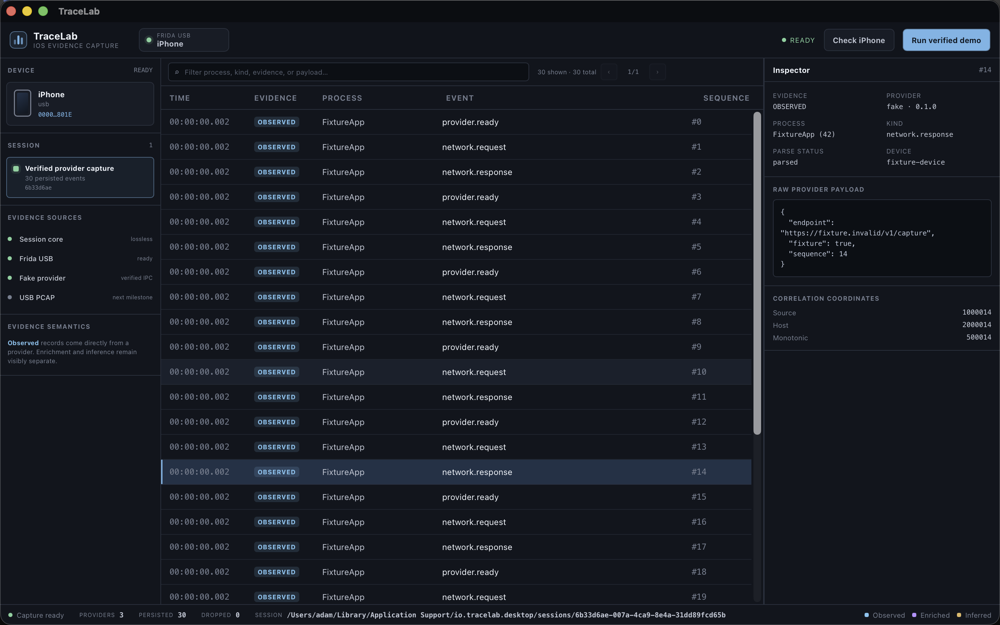

# TraceLab

TraceLab is a local-first macOS application for building loss-aware, inspectable iOS traffic-capture sessions. The current foundation release is a real Tauri application: it discovers a USB-connected iPhone through Frida, supervises a Python provider over a versioned MessagePack/Unix-socket boundary, persists append-only evidence, indexes the same events in SQLite, and exposes a dense paged timeline with a raw-event inspector.



## What works in this release

- Tauri 2 / Rust application core and Svelte 5 / TypeScript interface.
- Frida USB preflight against a paired, cable-connected iPhone.
- Single-active-capture guard and bounded command inputs.
- Python provider process supervised by Rust.
- Four-byte big-endian, 16 MiB-bounded MessagePack IPC over a private Unix socket.
- Deterministic end-to-end provider capture using the production IPC path.
- Explicit `observed`, `enriched`, and `inferred` evidence classes.
- Crash-conscious append-only JSONL, owner-only session directories, atomic finalization, SHA-256 checksums, and a rebuildable SQLite WAL index.
- Stable paged queries and nanosecond timestamps represented as decimal strings across the JavaScript boundary.
- High-density capture timeline, text filtering, keyboard-selectable rows, raw JSON inspector, provider health, persisted/dropped counters, and redacted device identity.
- Ad-hoc signed Apple Silicon `.app` bundle verified with strict deep code-signature validation.
- No application telemetry and no automatic chain or network enrichment.

## Current boundary

This repository is the independently usable **foundation milestone** described in the design specification. The **Run verified demo** action exercises the complete desktop/core/provider/storage/UI path with deterministic evidence; it does not label fixture traffic as device traffic. USB PCAP, syslog/process collection, the optional HTTP(S) proxy, laboratory-build instrumentation, pinned-TLS observation profiles, Solana decoding/correlation, exports, sanitization, and recovery/performance qualification remain separate milestones in the approved architecture.

The locally built application currently launches the Python provider from this checkout through `uv`; keep the checkout and `uv` environment available when moving the debug `.app` on this Mac. A self-contained release sidecar is part of the packaging milestone.

## Requirements

- macOS 14 or newer on Apple Silicon.
- Xcode Command Line Tools.
- Node.js 22 and pnpm 11.
- Rust stable with `rustfmt` and `clippy`.
- Python 3.12 or newer and `uv`.
- A paired, trusted iPhone connected by USB for the Frida preflight.
- Frida-compatible device state. A non-jailbroken device may require a debuggable laboratory build with an embedded Frida runtime for later instrumentation milestones.

The verified development machine and exact tool versions are recorded in [`docs/testing/foundation-verification.md`](docs/testing/foundation-verification.md).

## Install dependencies

```bash
pnpm install --frozen-lockfile
uv sync --project sidecars/ios-provider --extra test --frozen
```

## Run in development

```bash
pnpm tauri dev
```

In the application:

1. Connect and trust the iPhone over USB.
2. Select **Check iPhone** to run the structured Frida preflight.
3. Select **Run verified demo** to create a 30-event evidence session.
4. Filter or select timeline rows and inspect the exact raw provider payload.
5. Read the bottom health strip for persisted and dropped counters and the absolute session path.

## Build the macOS application

```bash
pnpm tauri build --debug --bundles app

APP="src-tauri/target/debug/bundle/macos/TraceLab.app"
xattr -cr "$APP"
codesign --force --deep --sign - --timestamp=none "$APP"
codesign --verify --deep --strict --verbose=2 "$APP"
```

The bundle is produced at:

```text
src-tauri/target/debug/bundle/macos/TraceLab.app
```

## Test and verify

```bash
pnpm test
pnpm check
pnpm build
uv run --project sidecars/ios-provider --extra test pytest -q
cargo fmt --manifest-path src-tauri/Cargo.toml --all -- --check
cargo test --manifest-path src-tauri/Cargo.toml --all-targets
cargo clippy --manifest-path src-tauri/Cargo.toml --all-targets -- -D warnings
```

The test matrix covers frontend command contracts and timeline rendering, Rust event/state/storage/protocol/capture/command contracts, and Python framing/fake-provider/Frida-preflight behavior.

## Session storage

Sessions are written beneath:

```text
~/Library/Application Support/io.tracelab.desktop/sessions/SESSION_UUID/
```

Foundation session layout:

```text
SESSION_UUID/
├── manifest.json
├── checksums.sha256
├── events/
│   └── provider-events.jsonl
└── database/
    └── session.sqlite
```

`provider-events.jsonl` is the append-only evidence source. SQLite is an index and can be rebuilt; it is not treated as the sole source of truth. `checksums.sha256` verifies finalized evidence artifacts.

Example integrity check:

```bash
cd "$HOME/Library/Application Support/io.tracelab.desktop/sessions/SESSION_UUID"
shasum -a 256 -c checksums.sha256
sqlite3 database/session.sqlite 'select count(*) from events;'
wc -l events/provider-events.jsonl
```

## Architecture and implementation plan

- [Approved design specification](docs/superpowers/specs/2026-07-22-trace-lab-design.md)
- [Foundation TDD implementation plan](docs/superpowers/plans/2026-07-22-tracelab-foundation.md)
- [Recorded foundation verification](docs/testing/foundation-verification.md)

## Security and data handling

- TraceLab does not transmit telemetry.
- External chain enrichment is inactive unless a later explicit analysis action invokes it.
- The UI redacts the connected device identifier.
- Session directories are created with owner-only permissions.
- Large/binary bodies are not routed through the frontend event channel.
- Seed phrases and private keys are outside the event contract and must never be recorded by providers.
- Use capture and instrumentation profiles only for applications and devices you control or are assigned to test.
