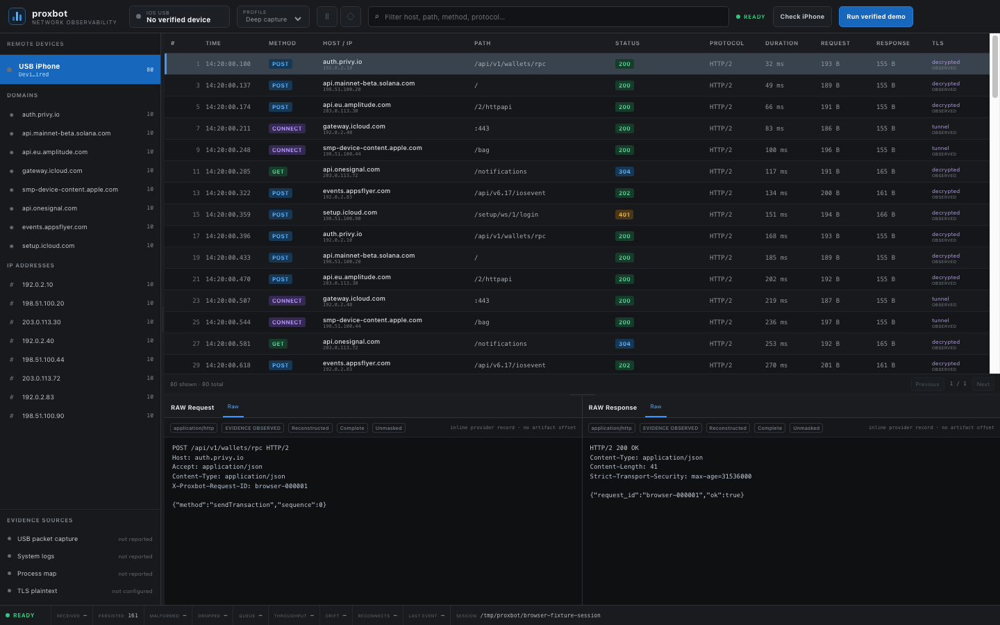

# proxbot

`proxbot` is a local macOS Tauri application for inspecting **bounded, persisted network-exchange evidence**. This branch delivers the React observability workspace and its end-to-end deterministic demo path:

```text
React 19 + TypeScript 7 + Vite 8 + Bun
                  │ typed Tauri commands
                  ▼
Tauri 2 / Rust session store and SQLite exchange index
                  │ versioned MessagePack / Unix socket
                  ▼
bundled Python provider (deterministic fake-provider demo)
```

The user interface is implemented with React. Bun is the repository's JavaScript package manager and script runner; the checked-in lockfile is [`bun.lock`](bun.lock). Vite builds `dist/`, which Tauri consumes as `../dist`.



## What the React observability workspace implements

- A Tauri desktop window with a compact toolbar, iPhone preflight action, text filter, and **Run verified demo** action.
- A virtualized device/endpoint navigator. It keeps **Domains** and **IP addresses** as distinct server-backed identities; selecting the device shows all exchanges, while selecting one domain or IP applies that exact filter. A 2,000-endpoint inventory keeps fewer than 100 tree rows mounted, with `ArrowUp`/`ArrowDown`/`Home`/`End` keyboard navigation.
- A virtualized request table with stable `requestId` selection, pagination, diagnostic columns for method, host/IP, path, status, protocol, duration, request/response byte counts, TLS label, and a visible missing-response warning.
- Two simultaneous inspector panes: **RAW Request** and **RAW Response**. A missing response stays absent rather than being synthesized. Each available raw view carries its media type plus reconstruction, truncation, masking, and artifact-offset/hash provenance when the provider supplied it.
- A persistent health strip with state, received, persisted, malformed, dropped, queue depth, throughput, drift, reconnect count, last-event age, and session path fields. The strip derives a degraded state when malformed or dropped counts are non-zero.
- Typed Tauri query commands backed by SQLite: `list_endpoints`, metadata-only `page_exchanges`, and one-row `get_exchange`. Endpoint summaries are capped at 2,000 entries; exchange pages are capped at 500 rows and the React workspace requests 200. Only the immutable selected `requestId` loads its request/response raw detail. Rust caps UTF-8 query strings at 1,024 bytes and endpoint/request IDs at 512 bytes; the search input also has a 1,024-character UX limit. Filtering and endpoint aggregation occur in Rust/SQLite rather than by scanning a complete session in React.
- A bounded runtime path: 180 ms text-query debounce, 75 ms selected-detail debounce, one cached `EventIndex` for the active session, and blocking SQLite work kept off the async command executor.
- A deterministic `create_demo_session` path that runs the fake provider through the production-style provider/runtime, MessagePack Unix-socket, append-only JSONL, SQLite-index, and typed-command boundaries. Its generated request/response pairs are explicitly fixture evidence, not claims about the connected iPhone's traffic.

## Current implementation boundary

The approved architecture describes broader capture and analysis milestones. This branch implements the **React/Bun/Vite observability UI and bounded exchange-query path**, plus the existing deterministic provider demo; it does not make the following claims:

- **Run verified demo is not a live iPhone traffic capture.** It creates a fake-provider session and materializes its fixture exchanges. The iPhone preflight command is separate from that demo action.
- There is **no implemented real HTTP(S) proxy workflow** in this UI, and no claim that traffic has been routed through a proxy.
- There is **no SSL/TLS pinning bypass**, no general TLS-plaintext extraction, and no claim that encrypted packet capture has been decrypted.
- This workspace does not yet deliver the broader synchronized device-PCAP/syslog/process workflow, laboratory-build instrumentation, protocol/Solana analysis, exports, sanitization, broad crash/fault-injection qualification, or ten-million-event performance qualification described in the design. It does implement and test deleted-index recovery from authoritative JSONL, same-cardinality event/exchange repair, and atomic ready-manifest publication.

The sidebar's provider/source presentation is workspace status chrome; it is not proof that those providers collected device evidence in a demo session. Treat the persisted fake-provider payload and its provenance labels as the evidence actually produced by the demo.

## Requirements

- macOS 14 or newer on Apple Silicon for the packaged desktop application.
- Bun (the JavaScript toolchain and package manager).
- Rust stable with `rustfmt` and `clippy` for Rust checks and the Tauri application.
- Python 3.12 or newer and `uv` for the iOS-provider environment and sidecar rebuild.
- A paired, trusted USB iPhone only when using the separate Frida preflight command; it is not required for the deterministic demo session.

## Install dependencies

```bash
bun install --frozen-lockfile
uv sync --project sidecars/ios-provider --extra test --frozen
```

## Run the workspace

Run the Vite client in a browser:

```bash
bun run dev
```

Run the Tauri desktop application (the command starts Vite through Tauri's configured `beforeDevCommand`):

```bash
bun run tauri dev
```

In the application:

1. Select **Check iPhone** to run the separate Frida USB preflight. A result only reports the preflight outcome.
2. Select **Run verified demo** to create deterministic fake-provider request/response evidence.
3. Use the device row, a domain, or an IP address to query the request table; use the filter box for bounded free-text filtering.
4. Select a table row to inspect its request and response at the same time. A row marked **Response missing** has no observed response pane.
5. Read the health strip and session-path field as the status surface for this demo UI.

## Build the desktop application

Build the frontend only:

```bash
bun run build
```

Build the bundled provider sidecar:

```bash
bun run build:provider
```

Build the debug macOS `.app` bundle (this first rebuilds the provider sidecar):

```bash
bun run tauri:build -- --debug --bundles app
```

When that build succeeds, the app bundle is produced beneath:

```text
src-tauri/target/debug/bundle/macos/proxbot.app
```

## Test and verify

Run the JavaScript/React suite, type check, and production frontend build:

```bash
bun run test
bun run check
bun run build
```

Run the provider and Rust suites when those toolchains are available:

```bash
uv run --project sidecars/ios-provider --extra test pytest -q
cargo fmt --manifest-path src-tauri/Cargo.toml --all -- --check
cargo test --manifest-path src-tauri/Cargo.toml --all-targets
cargo clippy --manifest-path src-tauri/Cargo.toml --all-targets -- -D warnings
```

The React tests cover the app, toolbar, bounded endpoint virtualization, virtual request table, simultaneous raw inspector, health strip, API contract, stale-result suppression, overlapping-operation accounting, independent error lanes, and persisted/clamped splitters. Rust tests cover command caps, transactional exchange indexing, authoritative JSONL recovery, cached-index same-cardinality repair, durable publication, and final-component/ancestor symlink refusal. Provider tests cover framing, runtime discovery, and the paired fake-provider exchange fixture.

For a record of the checks run for this branch, see [`docs/testing/react-observability-verification.md`](docs/testing/react-observability-verification.md). [`docs/testing/foundation-verification.md`](docs/testing/foundation-verification.md) is an explicitly historical foundation snapshot, not the current toolchain or UI verification record.

## Session evidence layout

The deterministic demo creates a session under:

```text
~/Library/Application Support/com.auersperg.proxbot/sessions/SESSION_UUID/
```

The finalized evidence subset is:

```text
SESSION_UUID/
├── manifest.json
├── checksums.sha256
├── events/
│   └── provider-events.jsonl
└── database/
    └── session.sqlite
```

During capture, the event record is `events/provider-events.jsonl.partial`; the session also creates owner-only `capture`, `logs`, `proxy`, `objects`, `database`, `sensitive`, `reports`, and `exports` directories for provider milestones. The implemented publication order is:

1. append the complete JSONL stream, flush it, and `fsync` it before updating derived SQLite rows;
2. atomically rename the JSONL `.partial` file;
3. write, `fsync`, and atomically promote `checksums.sha256.partial`;
4. write, `fsync`, and atomically promote `manifest.json.partial` last;
5. treat `manifest.status == "ready"` as the final commit marker and synchronize containing directories after renames.

`checksums.sha256` currently covers `events/provider-events.jsonl`. SQLite contains the event index and materialized exchange query view; it is rebuildable and is not the checksum-covered source of evidence.

Example inspection of a finalized session:

```bash
cd "$HOME/Library/Application Support/com.auersperg.proxbot/sessions/SESSION_UUID"
shasum -a 256 -c checksums.sha256
sqlite3 database/session.sqlite 'select count(*) from events;'
sqlite3 database/session.sqlite 'select count(*) from exchanges;'
wc -l events/provider-events.jsonl
```

## Design and implementation records

- [Approved product design](docs/superpowers/specs/2026-07-22-proxbot-design.md)
- [React observability implementation plan](docs/superpowers/plans/2026-07-22-react-observability-ui.md)
- [React observability verification record](docs/testing/react-observability-verification.md)
- [Historical foundation verification snapshot](docs/testing/foundation-verification.md)

## Security and data handling

- The application does not add application telemetry.
- The UI redacts the displayed device identifier in the navigator.
- Metadata pages exclude raw content, and only one selected exchange loads its stored inline raw request/response through `get_exchange`. Artifact references are currently provenance metadata; streaming or byte-range retrieval for large device-capture bodies is outside this milestone.
- Seed phrases and private keys are outside the provider-event contract and must not be recorded.
- Use device preflight and future capture/instrumentation capabilities only for devices and applications you control or are assigned to test.
