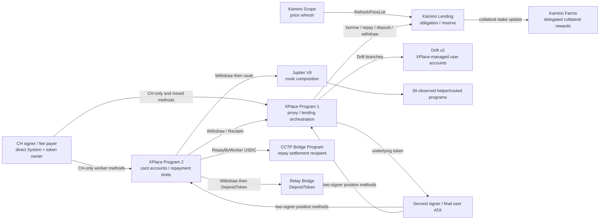

# `CHvpgjgJNDboeagrHRCA3hsyCddUjwf54LdvZ4tUzbHE` — полная карта средств, методов, CPI и helper-веток

**Network:** Solana mainnet-beta

**Direct-account snapshot:** slot `434759084`

**Token snapshot:** slots `434759086` / `434759087`

**Price snapshot:** `2026-07-23T17:36:05.599Z`, Jupiter Tokens V2 / Price V3

**Полная сигнатурная история на момент среза:** `202,066` transactions/address references

**Глубоко декодированное окно:** последние `5,226` transactions, `2026-07-20T21:00:23Z`…`2026-07-23T16:10:51Z`

**XPlace binary surface:** `15 + 40 = 55` application methods

**Наблюдавшиеся program IDs в глубоком окне:** `46`

## 0. Исправленный главный вывод

Предыдущая версия была неполной в трёх местах:

1. История останавливалась на `148,000` signatures. Pagination продолжена до пустой страницы: теперь сохранено **`202,066` уникальных finalized signatures**, от `2025-10-31T16:07:48Z` до `2026-07-23T16:10:51Z`.
2. `WithdrawKamino` действительно реализует то, что интерфейс показывает как withdrawal/remove-liquidity: XPlace Program 1 вызывает Kamino Lending, сжигает collateral receipt, получает underlying token и передаёт его пользователю.
3. Возможности XPlace расширяются атомарными ветками: Kamino Scope/Lending/Farms, XPlace Program 2, Drift, Jupiter и routed DEX, CCTP settlement и Relay Bridge. Их необходимо рассматривать не как независимые строки Solscan, а как единый transaction graph.

`CHvpg…UzbHE` одновременно является:

- System account, required signer и fee payer;
- operational/worker authority, записанным по byte offset `40` в Config PDA обеих XPlace-программ;
- единственным signer в подтверждённых worker flows;
- первым signer рядом с user signer в user-position flows.

При этом CH:

- не является upgrade authority XPlace/Kamino/Drift/Jupiter;
- не является admin/controller, записанным по offset `8`;
- не является прямым владельцем XPlace user PDA, Kamino obligations или Drift User accounts;
- не получает произвольный доступ ко всему program TVL: каждая ветка ограничена seeds, owner checks, whitelist, limits, oracle state, balances, downstream account graph и atomic-bundle validation.

## 1. Уровни доказательств

| Tier | Значение |
|---|---|
| `observed_recent_window` | finalized transaction декодирована: signers, logs, CPI stack, pre/post token balances и transfers |
| `observed_legacy_stratified_sample` | finalized transaction была в предыдущем временно-стратифицированном sample, но не попала в последние 5,226 |
| `binary_surface_only` | method/source label и guardrail strings присутствуют в текущем on-chain ProgramData binary, но execution в глубоком окне отсутствует |
| `inferred` | структурная связь по account owner/layout/atomic correlation; не превращается в authority claim без transaction evidence |

Главное правило отчёта: **наличие метода в binary не равняется праву CH вызвать его для произвольного user account**. Подтверждённый CH-only access отмечается только при успешной one-signer транзакции.

## 2. Карта владения, программ и helper-веток

### XPlace current-state inventory

| Program | Decoded account type | Count | Space | Lamports | Интерпретация |
|---|---|---:|---:|---:|---|
| XPlace 1 | `UserAccount` | 5,066 | 96 B | 8,139,747,842 | per-user proxy state |
| XPlace 1 | `UserId` | 5,066 | 13 B | 4,971,569,760 | ID mapping |
| XPlace 1 | `LoanSnapshot` | 3 | 34 B | 3,382,560 | synchronized loan state |
| XPlace 1 | `UserCounter` | 1 | 12 B | 974,400 | decoded value = `5,066` |
| XPlace 1 | `RotationState` | 1 | 81 B | 1,454,640 | authority rotation state |
| XPlace 1 | `Config` | 1 | 2,721 B | 19,829,040 | global integration/config state |
| XPlace 2 | `CardAccount` | 3,168 | 41 B | 3,726,404,185 | per-card limits/state |
| XPlace 2 | `SubscriptionStatus` | 16 | 30 B | 17,594,880 | subscription state |
| XPlace 2 | `RotationState` | 1 | 81 B | 1,454,640 | authority rotation state |
| XPlace 2 | `Config` | 1 | 381 B | 3,542,640 | global integration/config state |

Все `5,066` XPlace 1 UserAccount имеют non-zero rain-card link; `1,886` links совпали с текущим XPlace 2 CardAccount set. Остальные links могут отражать inactive/migrated/versioned card state и не трактуются как потерянные средства без version-aware historical join.

## 3. Доказанный `WithdrawKamino` на 3.5 USDT

Транзакция: [`P55mZa…Dtz56`](https://solscan.io/tx/P55mZaYeBsZhWMukvHohm8AjEeany5TCVtAafLMNUhc7epCAGQ2nTbJ4mKcv5r58QwQGFhdGpvYp2xLPTcDtz56), slot `434717846`, `2026-07-23T12:47:04Z`.

### Signers

1. `CHvpgjgJNDboeagrHRCA3hsyCddUjwf54LdvZ4tUzbHE`
2. user `GpfKa9WofAsH7oRbYMp7tNssM88EjhxyqWA6rPhgDcx8`

### Полная последовательность

1. Kamino Scope `RefreshPriceList`;
2. Kamino Lending `RefreshReserve` для USDT;
3. Kamino Lending `RefreshReserve` для debt reserve;
4. Kamino Lending `RefreshObligation`;
5. XPlace Program 1 `WithdrawKamino`;
6. CPI Kamino `WithdrawObligationCollateralAndRedeemReserveCollateralV2`;
7. SPL burn `2.977959` units collateral receipt mint `B8zf4koj…HMhSv`;
8. Kamino reserve supply `2Eff8Udy…S1o9N` → XPlace proxy ATA `Bf23xTGN…QAWgU`: `3.5 USDT`;
9. XPlace UserAccount PDA `ERVJFZ2f…M2tyv` signs the CPI transfer;
10. XPlace proxy ATA → final user ATA `FiztGA99…SAic9`: `3.5 USDT`;
11. Kamino Farms `SetStakeDelegated` updates remaining collateral reward stake.

### Роли точных accounts

| Role | Account |
|---|---|
| XPlace user | `GpfKa9WofAsH7oRbYMp7tNssM88EjhxyqWA6rPhgDcx8` |
| XPlace 1 `UserAccount` PDA | `ERVJFZ2fr1HD3cY12GZJJeNs9S3wPfRmFfUaprXM2tyv` |
| Kamino market authority | `9DrvZvyWh1HuAoZxvYWMvkf2XCzryCpGgHqrMjyDWpmo` |
| Kamino USDT reserve liquidity supply | `2Eff8Udy2G2gzNcf2619AnTx3xM4renEv4QrHKjS1o9N` |
| XPlace proxy USDT ATA | `Bf23xTGNJmCwm2HMQx9ejeN1nVYjoySBVBM7nmQQAWgU` |
| final user USDT ATA | `FiztGA99jq6KDYiwWjcekj7HzUaHWikGftAdMjxSAic9` |
| burned collateral receipt account | `CTCpzgNbPwWQSYamu4ZomgFuHf8DUGwq8hSYWVLurSJD` |

**Точная квалификация:** это removal/redemption **Kamino lending collateral**, а не снятие постоянной LP-позиции из Jupiter/Orca/Raydium/Meteora. Конкретная транзакция двухподписная; она подтверждает участие CH, но не подтверждает CH-only произвольный вывод.

## 4. XPlace Program 2 — все 15 методов

Обозначения: `R` = последние 5,226; `L` = предыдущий historical sample; `B` = binary-only.

| Method | Access class | Evidence | Tx / success / failed | 1 signer | 2 signers | Наблюдаемый или потенциальный эффект |
|---|---|---|---:|---:|---:|---|
| `Init` | admin/config | B | 0 | 0 | 0 | initialize global state |
| `UpdateConfig` | admin/config | B | 0 | 0 | 0 | update program configuration |
| `ConfirmAdminRotation` | admin/config | B | 0 | 0 | 0 | commit admin rotation |
| `Migrate` | admin/config | B | 0 | 0 | 0 | migrate state layout |
| `RepayByWorker` | worker | R | 1,697 / 1,697 / 0 | 1,697 | 0 | card USDC → CCTP settlement recipient + XPlace 2 fee vault |
| `ReclaimByWorker` | worker | R | 11 / 11 / 0 | 11 | 0 | XPlace 2 → XPlace 1 `RepayByWorkerKamino` → Kamino repay |
| `CreateAccount` | hybrid lifecycle | R | 36 / 34 / 2 | 36 | 0 | create CardAccount and PDA link |
| `UpdateRepayLimit` | user position | R | 31 / 30 / 1 | 0 | 31 | update per-tx/daily repay limits |
| `TopUp` | user funding | R | 939 / 837 / 102 | 939 | 0 | fund card PDA with USDC |
| `Withdraw` | user position | R | 482 / 474 / 8 | 0 | 482 | card USDC payout or continuation into repay/deposit/swap/bridge |
| `WithdrawByWorker` | worker | B | 0 | 0 | 0 | constrained worker withdrawal branch |
| `TakeSubscriptionPayment` | worker | B | 0 | 0 | 0 | subscription collection |
| `WithdrawRevenue` | admin/config | B | 0 | 0 | 0 | program revenue withdrawal |
| `UpdateSubscriptionConfig` | admin/config | B | 0 | 0 | 0 | subscription limits/configuration |
| `ReturnRefund` | worker | B | 0 | 0 | 0 | return/refund branch |

Binary guardrails include: enabled/pause state, token allowlist, per-transaction and daily limits, maximum repay fee, balance checks, subscription limits, swap source/destination structure and payment-state validation.

## 5. XPlace Program 1 — все 40 методов

| Method | Access class | Evidence | Tx / success / failed | 1 signer | 2 signers | Ветка |
|---|---|---|---:|---:|---:|---|
| `Init` | admin/config | B | 0 | 0 | 0 | initialize |
| `UpdateConfig` | admin/config | B | 0 | 0 | 0 | update config |
| `ExtendWhitelist` | admin/config | B | 0 | 0 | 0 | extend allowed assets/accounts |
| `ConfirmAdminRotation` | admin/config | B | 0 | 0 | 0 | admin rotation |
| `WithdrawRevenue` | admin/config | B | 0 | 0 | 0 | revenue withdrawal |
| `Migrate` | admin/config | B | 0 | 0 | 0 | state migration |
| `BatchCreateLoanSnapshot` | worker | B | 0 | 0 | 0 | batch snapshot initialization |
| `BorrowSyncByWorkerKamino` | worker | B | 0 | 0 | 0 | synchronized worker borrow |
| `BorrowByWorkerKamino` | worker | R | 559 / 559 / 0 | 559 | 0 | Kamino borrow → linked XPlace 2 card PDA |
| `RepaySyncByWorkerKamino` | worker | B | 0 | 0 | 0 | synchronized worker repay |
| `RepayByWorkerKamino` | worker | R | 11 / 11 / 0 | 11 | 0 | reclaimed XPlace 2 USDC → Kamino repay |
| `RepayByWorkerDrift` | worker | B | 0 | 0 | 0 | worker Drift repay |
| `BorrowByWorkerDrift` | worker | L | 6 / 6 / 0 | 6 | 0 | worker Drift borrow |
| `CreateAccount` | hybrid lifecycle | R | 196 / 112 / 84 | 196 | 0 | create XPlace UserAccount/UserId |
| `CreateAccountKamino` | hybrid lifecycle | R | 152 / 152 / 0 | 124 | 28 | init Kamino metadata/obligation |
| `CreateAccountDrift` | user position | B | 0 | 0 | 0 | create linked Drift user |
| `CloseAccountDrift` | user position | B | 0 | 0 | 0 | close linked Drift user |
| `RebalanceDrift` | worker | B | 0 | 0 | 0 | rebalance Drift |
| `UpdateBorrowLimit` | user position | B | 0 | 0 | 0 | per-user borrow limit |
| `DepositDrift` | user position | B | 0 | 0 | 0 | Drift deposit |
| `DepositKamino` | hybrid user/worker | R | 306 / 302 / 4 | 132 | 174 | deposit underlying, mint reserve collateral, update farms |
| `WithdrawDrift` | user position | B | 0 | 0 | 0 | Drift withdrawal |
| `WithdrawKamino` | user position | R | 212 / 208 / 4 | 0 | 212 | redeem Kamino collateral and pay underlying to user |
| `WithdrawAndSendKamino` | user position | R | 39 / 39 / 0 | 0 | 39 | redeem and forward in same atomic transaction |
| `BorrowSyncKamino` | user position | R | 4 / 4 / 0 | 0 | 4 | snapshot-bound synchronized borrow |
| `BorrowKamino` | user position | R | 48 / 48 / 0 | 0 | 48 | user borrow through Kamino |
| `BorrowDrift` | user position | B | 0 | 0 | 0 | user Drift borrow |
| `RepaySyncKamino` | user position | R | 2 / 2 / 0 | 0 | 2 | snapshot-bound synchronized repay |
| `RepayKamino` | user position | R | 171 / 171 / 0 | 0 | 171 | XPlace 2 withdrawal → Kamino repay |
| `RepayDrift` | user position | B | 0 | 0 | 0 | user Drift repay |
| `RepayWithBuffer` | user position | B | 0 | 0 | 0 | buffered repay |
| `RepayWithBufferKamino` | user position | B | 0 | 0 | 0 | Kamino buffered repay |
| `WithdrawByWorker` | worker | B | 0 | 0 | 0 | generic worker withdrawal |
| `WithdrawByWorkerKamino` | worker | B | 0 | 0 | 0 | potential worker Kamino collateral redemption |
| `CompleteDeleverageKamino` | worker | B | 0 | 0 | 0 | complete flash-loan/swap deleverage bundle |
| `ClaimDfxDrift` | worker | B | 0 | 0 | 0 | Drift/DFX claim path |
| `UpdateTargetBorrowApyKamino` | worker | R | 3 / 3 / 0 | 3 | 0 | target APY maintenance |
| `UpdateLoanSnapshotKamino` | hybrid | R | 7 / 7 / 0 | 1 | 6 | snapshot update |
| `ResetLoanSnapshotKamino` | worker | B | 0 | 0 | 0 | reset stale snapshot |
| `RevertRepayWithBufferKamino` | worker | B | 0 | 0 | 0 | timeout-governed buffer revert |

### Что helper layer добавляет к этой поверхности

Current binary содержит account names/source paths и validation branches для:

- Kamino reserves, obligations, market authority, collateral receipt mints, Farms states;
- Drift state, User/UserStats, spot markets, vaults и program signer;
- linked XPlace 2/rain-card account;
- flash-loan state, deleverage state и loan snapshots;
- swap instruction scanning, source/destination balance checks и tax-wallet checks;
- Merkle distributor/distributor vault;
- Token-2022 transfer hook/confidential-transfer checks.

Это объясняет, почему один top-level XPlace method способен дать длинную Solscan-карту. Helper не отменяет permission checks; он **композирует** разрешённые действия в одну атомарную транзакцию.

## 6. Реальные atomic-flow correlations

| Count | Signers | Atomic sequence | Значение |
|---:|---|---|---|
| 1,696 | 1 | XPlace 2 `RepayByWorker` | worker repayment settlement |
| 906 | 1 | XPlace 2 `TopUp` | card funding |
| 559 | 1 | XPlace 1 `BorrowByWorkerKamino` → KLend `BorrowObligationLiquidityV2` | automated Kamino borrow to card |
| 189 | 2 | XPlace 1 `WithdrawKamino` → KLend collateral redemption → Farms stake update | collateral withdrawal/remove-liquidity |
| 170 | 2 | XPlace 2 `Withdraw` → XPlace 1 `RepayKamino` → KLend repay | card funds repay loan |
| 142 | 72×1 + 70×2 | XPlace 1 `DepositKamino` → KLend deposit → Farms stake update | collateral deposit |
| 118 | 2 | XPlace 2 `Withdraw` | direct card payout branch |
| 112 | 1 | XPlace 1 `CreateAccount` → `CreateAccountKamino` → `InitUserMetadata` → `InitObligation` | user/obligation bootstrap |
| 76 | 2 | Jupiter `RouteV2` | standalone routed swap |
| 48 | 2 | XPlace 1 `BorrowKamino` → KLend borrow | user borrow |
| 43 | 21×1 + 22×2 | init Farms → XPlace 1 deposit → KLend deposit → Farms update | first deposit with farm init |
| 39 | 2 | XPlace 1 `WithdrawAndSendKamino` → KLend redemption → Farms update | redeem and forward |
| 39 | 2 | XPlace 2 `Withdraw` → XPlace 1 `DepositKamino` → KLend deposit → Farms | card funds become collateral |
| 33 | 1 | XPlace 2 `CreateAccount` → `TopUp` | create and fund card |
| 29 | 2 | XPlace 2 `Withdraw` → Relay Bridge `DepositToken` | bridge funding |
| 25 | 1 | XPlace 1 `DepositKamino` → KLend deposit | collateral deposit without Farms update |
| 23 | 2 | XPlace 1 `WithdrawKamino` → KLend redemption | withdrawal without Farms update |
| 20 | 2 | XPlace 2 `Withdraw` → Jupiter `RouteV2` | card withdrawal converted through Jupiter |
| 11 | 1 | XPlace 2 `ReclaimByWorker` → XPlace 1 `RepayByWorkerKamino` → KLend repay | cross-program worker recovery/repay |
| 10 | 2 | XPlace 2 `UpdateRepayLimit` → `Withdraw` | limit update and payout |
| 10 | 2 | XPlace 2 `Withdraw` → Jupiter SharedAccountsRouteV2 | card withdrawal converted through Jupiter |
| 8 | 2 | XPlace 2 `Withdraw` → Jupiter → Meteora DLMM | card withdrawal converted through DLMM |
| 5 | 2 | XPlace 2 `Withdraw` → Jupiter → 1DEX | card withdrawal routed through 1DEX |
| 4 | 2 | `UpdateLoanSnapshotKamino` → `BorrowSyncKamino` → KLend borrow | snapshot-bound borrow |

Анализ выявил `121` distinct sequence variants; верхние `75` с success/failure и example signatures находятся в `artifacts/solana/ch-atomic-flow-correlations.csv`.

## 7. Helper-программы и routed liquidity

### Core lending/bridge helpers

| Program | Address | Recent relationship | Tx count / instructions |
|---|---|---|---|
| Kamino Lending | `KLend2g3…avgmjD` | direct CPI from XPlace 1 | 1,467 tx; 3,560 RefreshReserve; 1,353 RefreshObligation; 611 borrow; 302 deposit; 251 withdraw/redeem; 184 repay |
| Kamino Scope | `HFn8GnP…F2fWJ` | oracle refresh before lending | 1,353 `RefreshPriceList` |
| Kamino Farms | `FarmsPZ…Ja91Hr` | delegated collateral rewards | 502 tx; 502 `SetStakeDelegated`; 61 `InitializeUser` |
| CCTP Bridge Program | `ccfVv3f…jMnJFNEy` | owner of settlement recipient for XPlace 2 repay | 1,697 related repayments; `130,647.95 USDC` received in decoded window |
| Relay Bridge | `99vQwtB…cfnJSrN2` | top-level after XPlace 2 Withdraw | 33 `DepositToken`; 29 linked XPlace-withdraw bundles passed `2,528.469888 USDC` |

Current CCTP helper binary SHA-256: `4044c16d7ad4c06b6a41e80a736b1d9bc12236af589b39cf1799ba4f7d2e3315`; visible methods: `InitializeConfig`, `UpdateConfig`, `ProposeUpdateAuthority`, `CommitUpdateAuthority`, `Settle`, `Bridge`. In the 1,697 `RepayByWorker` transactions USDC is transferred to a token account owned by the bridge program; that same transaction does not invoke the bridge program, so это settlement input, а не доказательство завершённого cross-chain message в том же slot.

Relay binary SHA-256: `93a89aef6dd30e66f4cda6d3dafecddbfe58ecc98e5596dbc832feaf5eed9e91`; visible methods: `Initialize`, `SetAllocator`, `SetOwner`, `MigrateDomainSeparator`, `DepositNative`, `DepositToken`, `ExecuteTransfer`. Guardrails include allocator signer, ed25519 request verification, signature expiry, domain separator, recipient/mint/vault matching and replay/reentrancy checks.

### Jupiter route and nested program matrix

| Program | Address | Transactions | Decoded nested methods |
|---|---|---:|---|
| Jupiter V6 | `JUP6Lkb…NyVTaV4` | 258 | `RouteV2` 133; `SharedAccountsRouteV2` 125 |
| GoonFi V2 | `goonudd…HtURSLE` | 107 | routed liquidity |
| Quantum | `QuaNtZs…2BN9bBDv` | 30 | routed liquidity |
| Meteora DLMM | `LBUZKhR…YuVaPwxo` | 50 | `Swap` 55; `Swap2` 2 invocations |
| AlphaQ | `ALPHAQm…Srvs4pHA` | 50 | routed liquidity |
| Deriverse | `DRVSpZ2…DgRnrgqD` | 24 | routed liquidity |
| BisonFi | `BiSoNHV…KshCSUypi` | 35 | routed liquidity |
| TesseraV | `TessVdM…4x83GLQH` | 25 | routed liquidity |
| Manifest | `MNFSTqt…LByLd1k1Ms` | 37 | routed liquidity |
| Whirlpool | `whirLbM…ff3uctyCc` | 21 | `Swap` 15; `SwapV2` 9 invocations |
| Raydium CLMM | `CAMMCzo…grrKgrWqK` | 25 | `Swap` 26 |
| Aquifer | `AQU1FRd…fKU3bTz45` | 13 | routed liquidity |
| 1DEX | `DEXYosS…gYCaqPMTm` | 11 | `SwapExactAmountIn` 11 |
| Invariant | `HyaB3W9…cEbRaJutt` | 13 | `Swap` 13 |
| HumidiFi | `9H6tua7…iNN3q6Rp` | 16 | routed liquidity |
| ZeroFi | `ZERor4x…tCf4hbZY` | 13 | `swap_v4` 13 |
| Flux | `FLUX6xB…DzSpCsvfK` | 5 | routed liquidity |
| Byreal | `REALQqN…NnfxQ5N2` | 14 | `SwapV3Dyn` 14 |
| PancakeSwap | `HpNfyc2…B2qjx8jxFq` | 9 | `Swap` 9; `SwapV2` 1 |
| Mercurial | `MERLuDF…cU2HKky` | 3 | `Exchange` 3 |
| Jupiter Perps | `PERPHjG…fdBS2qQJu` | 2 | `Swap2` 1; `AddLiquidity2` 1 |
| Orca V2 | `9W959Dq…eTEdp3aQP` | 3 | `Swap` 3 |
| Saber | `SSwpkEE…52nZg1UZ` | 1 | `Swap` 1 |
| DexLab | `DSwpgjM…HJpdJtmg6N` | 2 | `Swap` 2 |
| SolFi V2 | `SV2EYYJ…yo13WtupPF` | 3 | routed liquidity |
| Scorch Router / Scorch | `SCoRcH8…Xxx3mqn` / `ojh19…Corch` | 5 | nested router |
| Raydium AMM | `675kPX9…wFSUt1Mp8` | 3 | routed liquidity |
| Meteora AMM | `Eo7WjKq…5EQVn5UaB` | 1 | `Swap` 1 |
| Meteora Vault | `24Uqj9J…G3LYwBpyTi` | 1 | `Deposit` 1 + `Withdraw` 1 in the same route |

### Почему `AddLiquidity2`/Vault `Deposit` не считаются CH LP position

Эти инструкции находятся внутри Jupiter route и в одной транзакции могут сразу сопровождаться `Swap`/`Withdraw`. Без CH-owned position NFT/share account и сохраняющегося post-balance это transitory route mechanics. Поэтому:

- **Kamino `WithdrawKamino`** — подтверждённая collateral redemption capability;
- **Jupiter Perps `AddLiquidity2`** и **Meteora Vault `Deposit` + `Withdraw`** — наблюдённые helper CPIs;
- **persistent direct Orca/Raydium/Meteora LP position CH** — текущих доказательств нет.

## 8. Средства и объёмы по каждой ветке

### 8.1 Текущие прямые и program-controlled balances

| Класс | Balance | USD mark | Attribution/access |
|---|---:|---:|---|
| CH System balance | `3.914160213 SOL` | `$297.226905` | direct CH signature |
| CH SPL/Token-2022 | 21 ATA, 20 non-zero | `$9.885230` | direct token owner; delegates 0 |
| Recoverable ATA rent | `0.0431868 SOL` | `$3.279446` | only after token cleanup/close |
| XPlace 2 Config ATA | `1,431.4 USDC` | `$1,431.263981` | program-controlled; CH operational authority, not token owner |
| XPlace 1 Config ATA | `0 USDC` | `$0` | program-controlled empty ATA |
| All XPlace 2 account-state lamports | `3.748996345 SOL` | not CH net worth | rent/state across all card users |
| All XPlace 1 account-state lamports | `13.136958242 SOL` | not CH net worth | rent/state across all XPlace users |
| Direct Kamino positions for CH | 0 obligations, 0 KVault, 0 rewards | `$0` | XPlace user obligations are separate |
| Direct Drift User accounts for CH | 0 | `$0` | XPlace-managed Drift accounts are separate |

**Direct liquid mark excluding recoverable rent:** `$307.112135`.

**Including potentially recoverable ATA rent:** `$310.391581`.

**Observed aggregate including the XPlace 2 Config vault:** `$1,741.655562`, but this is not CH net worth: only `$310.391581` is directly attributable to CH, while `$1,431.263981` is held by a program-owned Config PDA.

### 8.2 Все 21 direct token accounts

| Symbol | Mint | Amount | USD mark | Quality / extensions |
|---|---|---:|---:|---|
| SOL ATA | `So11111111111111111111111111111111111111112` | 0 | $0.000000 | verified/high |
| cbBTC | `cbbtcf3aa214zXHbiAZQwf4122FBYbraNdFqgw4iMij` | 0.000005 | $0.324301 | verified/high |
| RENDER | `rndrizKT3MK1iimdxRdWabcF7Zg7AR5T4nud4EkHBof` | 0.108828 | $0.161208 | verified/medium |
| JLP | `27G8MtK7VtTcCHkpASjSDdkWWYfoqT6ggEuKidVJidD4` | 0.097682 | $0.355548 | verified/high |
| WBTC | `3NZ9JMVBmGAqocybic2c7LQCJScmgsAZ6vQqTDzcqmJh` | 0.000004 | $0.258828 | verified/high |
| ETH | `7vfCXTUXx5WJV5JADk17DUJ4ksgau7utNKj4b963voxs` | 0.000339 | $0.640162 | verified/high |
| NVDA | `9dwPiStDBwJJqC3QzMnjpJP7xohZbMVmHELFx3uy3KRq` | 2442.045041 | $0.193226 | verified/low |
| syrupUSDC | `AvZZF1YaZDziPY2RCK4oJrRVrbN3mTD9NL24hPeaZeUj` | 0.146014 | $0.171508 | verified/medium |
| USDTet | `Dn4noZ5jgGfkntzcQSUZ8czkreiZ1ForXYoV2H8Dm7S1` | 0.18054 | $0.180291 | verified/low |
| USDC | `EPjFWdd5AufqSSqeM2qN1xzybapC8G4wEGGkZwyTDt1v` | 2.360206 | $2.359982 | verified/high |
| USDT | `Es9vMFrzaCERmJfrF4H2FYD4KCoNkY11McCe8BenwNYB` | 3.675214 | $3.671941 | verified/high |
| MELANIA | `FUAfBo2jgks6gB4Z4LfZkqSZgzNucisEHqnNebaRxM1P` | 1.664863 | $0.133320 | verified/low |
| BIG | `Foot4fxy8CHxM37W8BeHwK6aLd8VH2yHTFu43KCxbCqc` | 2111.52805 | $0.223159 | unverified/low |
| TRX | `GbbesPbaYh5uiAZSYNXTc7w9jty1rpg3P9L4JeN4LkKc` | 0.567393 | $0.185554 | verified/low |
| JitoSOL | `J1toso1uCk3RLmjorhTtrVwY9HJ7X8V9yYac6Y7kGCPn` | 0.005016 | $0.491795 | verified/high |
| Punch | `NV2RYH954cTJ3ckFUpvfqaQXU4ARqqDH3562nFSpump` | 16.957433 | $0.020497 | Token-2022 immutableOwner |
| 雪山救狐 | `ijq5Vaxog5xZvqbt9NfGpm7mndrwBGQaydXNNsmpump` | 138.380711 | $0.000445 | unverified; immutableOwner |
| PUMP | `pumpCmXqMfrsAkQ5r49WcJnRayYRqmXz6ae8H7H9Dfn` | 100.149013 | $0.192448 | immutableOwner + transferHookAccount |
| PYUSD | `2b1kV6DkPAnxd5ixfnxCpjxmKwqjjaYmCZfHsFu24GXo` | 0.173242 | $0.173226 | transfer fee/hook; withheld 0 |
| ANSEM | `9cRCn9rGT8V2imeM2BaKs13yhMEais3ruM3rPvTGpump` | 0.867303 | $0.144304 | immutableOwner |
| DURCOIN | `BKMp8wXfbsRjAQ65rpDgUPjL8s1xFDAtVWzw3eeQpump` | 777 | $0.003487 | unverified/low |

Полный account-level ledger с ATA addresses, raw amounts, decimals, authorities и valuation — `artifacts/solana/ch-account-funds.csv`.

### 8.3 Recent-window flow volumes — не current balances

| Branch | Transactions | Flow |
|---|---:|---|
| XPlace 2 `TopUp` | 939 / 837 success | net `278,214.221722 USDC` entered linked XPlace 2 card PDAs |
| XPlace 2 `Withdraw` | 482 / 474 success | net `188,006.503712 USDC` left linked XPlace 2 card PDAs and continued into payout/repay/deposit/swap/bridge branches |
| XPlace 2 `RepayByWorker` | 1,697 | `130,828.15 USDC` left XPlace 2 card PDAs; `130,647.95` reached the CCTP bridge-owned recipient; `180.20` reached XPlace 2 Config |
| XPlace 1 `BorrowByWorkerKamino` | 559 | `33,384.16 USDC` left Kamino reserve-side accounts; `33,383.40` reached linked XPlace 2 PDAs |
| XPlace 1 `RepayKamino` | 171 | `109,964.173647 USDC` entered Kamino reserve-side accounts from card-withdrawal bundles |
| XPlace 1 `ReclaimByWorker` → `RepayByWorkerKamino` | 11 | `176.31 USDC` moved from XPlace 2 PDAs into Kamino repayment |
| XPlace 1 `DepositKamino` | 306 / 302 success | reserve-side net inflow: `502.289788393 SOL`, `27,033.289991 USDC`, `17,414.767888 USDT`, `1.42992254 ETH`, `0.35712093 cbBTC`, `0.292545734 JitoSOL` |
| XPlace 1 `WithdrawKamino` | 212 / 208 success | reserve-side underlying released: `188.779966172 SOL`, `8,635.661098 USDC`, `14,486.136557 USDT`, `0.50666065 ETH`, `0.33973854 cbBTC`, `0.14623785 JitoSOL` |
| XPlace 1 `WithdrawKamino` receipt burns | 212 | `165,105.541975 kSOL`, `7,242.801343 kUSDC`, `12,326.912994 kUSDT`, `49.643946 kETH`, `33.959423 kcbBTC`, `146.090183 kJitoSOL` receipt units |
| XPlace 1 `WithdrawAndSendKamino` | 39 | reserve-side underlying released and forwarded: `66.021304417 SOL` plus `1,976.873832 USDT` |
| XPlace 1 `BorrowKamino` | 48 | `1,943.944674 USDC` released from Kamino; `1,893.954632` reached currently attributable user signers and `49.990042` reached other transaction recipients |
| XPlace 1 `BorrowSyncKamino` / `RepaySyncKamino` | 4 / 2 | synchronized snapshot branches: `21.550578 USDC` borrow-side outflow; `43.212154 USDC` repay-side inflow |
| XPlace 2 `Withdraw` → Relay | 29 | `2,528.469888 USDC` entered linked Relay `DepositToken` branches |

Эти суммы — net role deltas внутри 67.2-часового decoded window. Строки atomic bundles могут пересекаться, поэтому их нельзя складывать в один TVL. Это не текущий баланс, не all-time volume и не средства, автоматически принадлежащие CH.

## 9. Signer/capability lattice

### Подтверждённые CH-only execution branches

- XPlace 2 `RepayByWorker`: 1,697 success;
- XPlace 2 `ReclaimByWorker`: 11 success;
- XPlace 2 `CreateAccount`: 34 success, 2 failed attempts;
- XPlace 2 `TopUp`: 837 success, 102 failed attempts;
- XPlace 1 `BorrowByWorkerKamino`: 559 success;
- XPlace 1 `RepayByWorkerKamino`: 11 success;
- XPlace 1 `BorrowByWorkerDrift`: 6 success в legacy sample;
- XPlace 1 `UpdateTargetBorrowApyKamino`: 3 success;
- часть lifecycle/deposit/snapshot flows: `CreateAccount`, `CreateAccountKamino`, `DepositKamino`, `UpdateLoanSnapshotKamino`.

### Подтверждённые CH + user branches

- XPlace 2 `UpdateRepayLimit`: 31 attempts;
- XPlace 2 `Withdraw`: 482 attempts;
- XPlace 1 `WithdrawKamino`: 208 success, 4 failed attempts;
- XPlace 1 `WithdrawAndSendKamino`: 39 success;
- XPlace 1 `BorrowKamino`: 48 success;
- XPlace 1 `RepayKamino`: 171 success;
- XPlace 1 `BorrowSyncKamino`: 4 success;
- XPlace 1 `RepaySyncKamino`: 2 success;
- часть `CreateAccountKamino`, `DepositKamino`, `UpdateLoanSnapshotKamino`;
- Jupiter routes, когда они продолжают user withdrawal.

### Потенциальные worker branches без recent execution

`WithdrawByWorker`, `WithdrawByWorkerKamino`, `CompleteDeleverageKamino`, `BorrowSyncByWorkerKamino`, `RepaySyncByWorkerKamino`, `RepayByWorkerDrift`, `RebalanceDrift`, `ClaimDfxDrift`, `ResetLoanSnapshotKamino`, `RevertRepayWithBufferKamino`, а также XPlace 2 subscription/refund worker methods.

Это важная граница: названия показывают архитектурно предусмотренный worker path, но successful captured invocation необходим для вывода о фактической доступности CH.

## 9A. Поддерживаемые пути расширения полномочий

Live Config snapshot at slot `434759457`:

| Program | Config PDA | Admin/controller, offset 8 | Worker, offset 40 |
|---|---|---|---|
| XPlace 2 | `9CX9RyosaZusW7KZsNGSw4znN3kXZ9neFLgUHAQc6DWb` | `6yANiqv13yE9TFzj4y3M1zceSdMw77xHegGCnXdJzrAn` | `CHvpgjgJNDboeagrHRCA3hsyCddUjwf54LdvZ4tUzbHE` |
| XPlace 1 | `HHdYSwJ4KNtw45nYTFwEyxJ5qamGTEdD2e4vKxuVbRcx` | `6yANiqv13yE9TFzj4y3M1zceSdMw77xHegGCnXdJzrAn` | `CHvpgjgJNDboeagrHRCA3hsyCddUjwf54LdvZ4tUzbHE` |

Обе XPlace-программы имеют общую BPF upgrade authority
`61XyY6sTZfCSzKom9HjZcHbXrvSnWkqhS4aAGvs2ro5u`; CH ею не является.

| Путь | Кто должен разрешить/подписать | Что реально расширяется | Уровень |
|---|---|---|---|
| Config/whitelist enablement | текущий XPlace admin `6yAN…zrAn` | whitelist, limits, enabled branches и область применения уже существующей worker-роли CH; может сделать practically reachable предусмотренные binary worker methods | operational |
| Admin rotation | текущий admin инициирует предусмотренное rotation state, CH завершает `ConfirmAdminRotation` по правилам программы | `UpdateConfig`, `ExtendWhitelist` в XPlace 1, `UpdateSubscriptionConfig` в XPlace 2, `WithdrawRevenue`, `Migrate` и другие admin/config branches | administrative |
| XPlace upgrade-authority transfer или включение CH в управляющий multisig | текущая upgrade authority `61Xy…ro5u` | upgrade/deploy authority для обеих XPlace-программ; это выше program admin | code-level / maximum |
| User delegation или вторая user signature | конкретный владелец user position | только его scoped withdraw/borrow/repay/limit/deposit branches; не глобальный admin | per-user |
| Config-vault revenue custody | XPlace admin/config path и проверки `WithdrawRevenue` | разрешённый вывод program revenue, включая Config-owned vault при выполнении destination/seed checks; не произвольные user balances | treasury-scoped |
| Kamino/Drift/Jupiter protocol role | независимая authority/governance каждой внешней программы | отдельные protocol-level права; XPlace admin и XPlace upgrade authority автоматически их не дают | external |
| Token mint/freeze authority | текущая authority конкретного mint | управление только соответствующим токеном; не связано с XPlace worker/admin | asset-specific |

В текущем Config CH уже имеет максимальный **наблюдённый operational worker scope**, но не administrative/code-level scope. В 5,226 глубоко декодированных транзакциях и current binary surface не обнаружена отдельная CH-only self-escalation branch, которая сама переписывает admin либо BPF upgrade authority. Поэтому три практических ступени таковы:

1. admin включает дополнительные worker branches через config/whitelist;
2. admin rotation переводит CH в program admin;
3. текущая BPF upgrade authority передаёт loader-level authority либо добавляет CH в управляющий multisig.

## 10. Историческое покрытие

Официальный Solana RPC `getSignaturesForAddress` возвращает confirmed/finalized signatures, в account keys которых встречается адрес, newest-first и с pagination `before`. Crawler шёл до пустой страницы:

- unique finalized signatures: `202,066`;
- success: `197,047`;
- failed: `5,019`;
- oldest: `4GZXP5d…75qB6`, `2025-10-31T16:07:48Z`;
- newest snapshot signature: `44JmyxHK…vBVFE`, `2026-07-23T16:10:51Z`;
- complete at snapshot: `true`;
- later chain activity может появиться после этого recorded newest signature.

Сигнатурная полнота не подменяет instruction decoding: все `5,226` последних transactions декодированы глубоко, а full-history signatures сохранены как coverage proof. Solana отдельно поясняет, что standard RPC пригоден для verification, а большие historical instruction analytics обычно требуют indexing pipeline.

## 11. Методика, ограничения и источники

1. Signatures: официальный [`getSignaturesForAddress`](https://solana.com/docs/rpc/http/getsignaturesforaddress).
2. Transactions, logs, inner instructions, loaded keys, pre/post balances: официальный [`getTransaction`](https://solana.com/docs/rpc/http/gettransaction) и [Solana RPC JSON structures](https://solana.com/docs/rpc/json-structures).
3. Current accounts: `getAccountInfo`, `getProgramAccounts`, `getTokenAccountsByOwner`.
4. XPlace methods/account types/guardrails: current on-chain ProgramData binaries:
   - XPlace 1 SHA-256 `ff1c8445dc9c6ce287ccdaf5455654a87e0ce5dcde2984882bc119604aafaaa5`;
   - XPlace 2 SHA-256 `69e96442df0248956c564d3f2d0870596744da400f3c53d01c16573478de5259`.
5. Kamino’s developer surface explicitly includes deposit/withdraw, borrow/repay, user loan data and market state: [Kamino developer docs](https://docs.kamino.finance/).
6. Drift delegated accounts have deliberately limited delegate abilities; withdrawal/borrow remains owner-sensitive: [Drift delegated accounts](https://docs.drift.trade/protocol/getting-started/delegated-accounts).
7. Jupiter labels classify routed programs, while transaction logs establish the exact invocation graph.
8. USD marks are recorded Jupiter price observations, not executable quotes.

### Не приписано CH

- all XPlace TVL;
- collateral/debt каждого из 5,066 XPlace users;
- program-owned account rent;
- bridge vault TVL;
- routed DEX pool liquidity;
- XPlace admin/controller или program upgrade authority;
- unrestricted withdrawal from arbitrary user positions.

## 12. Артефакты

- `artifacts/solana/ch-account-interaction-map.json` — основной map schema v3;
- `artifacts/solana/ch-cpi-capability-map.json` — глубокая CPI/capability карта, exact example, helpers, states и 75 atomic sequences;
- `artifacts/solana/ch-method-capabilities.csv` — все 55 XPlace methods с evidence/access/signer counts;
- `artifacts/solana/ch-atomic-flow-correlations.csv` — atomic sequence correlations и example signatures;
- `artifacts/solana/ch-account-funds.csv` — полный direct/program fund ledger;
- `scripts/research/build-ch-capability-artifacts.mjs` — детерминированная сборка артефактов из decoded transaction/state inputs.
