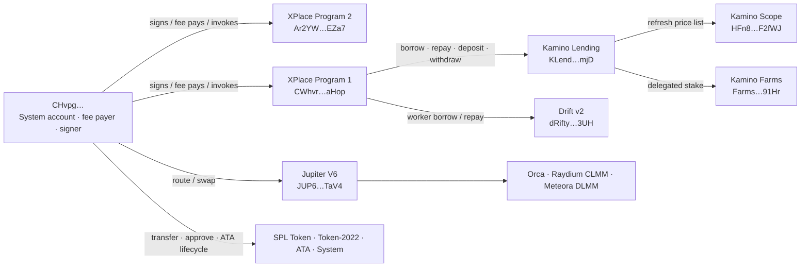

# CHvpg… — карта on-chain взаимодействий и доступов

**Account:** `CHvpgjgJNDboeagrHRCA3hsyCddUjwf54LdvZ4tUzbHE`  
**Network:** Solana mainnet-beta  
**Snapshot slot:** `434738815`  
**Map status:** verified from Solana mainnet RPC transaction messages, execution
logs, account state, token-account state, and upgradeable-program metadata.

## Executive map



## 1. Account identity and native authority

| Field | Verified state |
|---|---|
| Account owner | `11111111111111111111111111111111` — System Program |
| Executable | `false` |
| Account data | empty; `0` bytes |
| Native SOL at snapshot | `4.336825655 SOL` |
| Program upgrade authority | no observed program has `CHvpg…` as upgrade authority |

`CHvpg…` is an externally signable System account, not a program account or
PDA. Its generic on-chain authority is the ability to authorize messages for
which it appears in a required signer slot.

### Signer and fee-payer pattern

The temporal-stratified transaction sample contains `148` finalized
transactions. In all `148`:

```text
static account index 0 = CHvpg…
CHvpg… is a required signer
CHvpg… is the fee payer
```

Signer layouts in that sample:

| Required signer layout | Count |
|---|---:|
| `CHvpg…` only | `101` |
| `CHvpg…` plus one additional signer | `47` |

This demonstrates that `CHvpg…` is the transaction initiator / fee sponsor in
the observed flows. A second signer appears when an operation needs a wallet
or account-specific authorization in addition to the backend signer.

## 2. Historical coverage and evidence model

The RPC crawler enumerated **148,000 finalized signatures** for `CHvpg…` from:

```text
2026-03-14 16:28:40 UTC
through
2026-07-23 15:05:15 UTC
```

The inventory includes `4,773` execution-failed signatures and `143,227`
successful signatures. The next historical cursor is preserved, so the
enumeration can continue deterministically toward the account's first
transaction without duplicating the collected range.

Detailed message/log decoding used a temporal-stratified sample of `148`
successful finalized transactions across the collected range plus direct
verification of the recent live transactions. Counts below are **observed
method evidence counts in that stratified sample**, not a claim that the sample
count equals the all-time invocation total.

## 3. Program interaction map

### XPlace Program 2

```text
PROGRAM: Ar2YWzaGxR55YKLx2jNdXuD6RrX9tbu3EsKvxgF7EZa7
UPGRADE AUTHORITY: 61XyY6sTZfCSzKom9HjZcHbXrvSnWkqhS4aAGvs2ro5u
CHvpg… IS UPGRADE AUTHORITY: false
```

Observed successfully invoked methods:

| Method | Sample evidence |
|---|---:|
| `RepayByWorker` | 51 |
| `TopUp` | 26 |
| `Withdraw` | 13 |
| `CreateAccount` | 3 |
| `UpdateRepayLimit` | 2 |

This is the dominant observed application-control program. `CHvpg…` is passed
to these instructions as a required signer and fee payer. The records show
worker repayment, top-up, withdrawal, account creation, and repayment-limit
update flows, rather than program upgrade authority.

### XPlace Program 1

```text
PROGRAM: CWhvrgNvYNdkT4gnjPcdVxaNB8HQkXgBTsJAwp3GaHop
UPGRADE AUTHORITY: 61XyY6sTZfCSzKom9HjZcHbXrvSnWkqhS4aAGvs2ro5u
CHvpg… IS UPGRADE AUTHORITY: false
```

Observed successfully invoked methods:

| Method | Sample evidence |
|---|---:|
| `BorrowByWorkerKamino` | 9 |
| `DepositKamino` | 7 |
| `CreateAccount` | 6 |
| `BorrowByWorkerDrift` | 6 |
| `RepayKamino` | 5 |
| `CreateAccountKamino` | 3 |
| `BorrowKamino` | 2 |
| `WithdrawAndSendKamino` | 1 |
| `RepayDrift` | 1 |

This program mediates the observed lending/deposit/borrow flows. It calls into
Kamino and Drift while `CHvpg…` supplies the top-level transaction signature
and fee sponsorship.

### Kamino protocol stack

| Program | Address | Observed methods / role | `CHvpg…` upgrade authority |
|---|---|---|---|
| Kamino Lending / KLend | `KLend2g3cP87fffoy8q1mQqGKjrxjC8boSyAYavgmjD` | `RefreshReserve`, `RefreshObligation`, `BorrowObligationLiquidityV2`, `DepositReserveLiquidityAndObligationCollateralV2`, `RepayObligationLiquidityV2`, obligation initialization and collateral redemption | no |
| Kamino Scope Oracle | `HFn8GnPADiny6XqUoWE8uRPPxb29ikn4yTuPa9MF2fWJ` | `RefreshPriceList` | no |
| Kamino Farms | `FarmsPZpWu9i7Kky8tPN37rs2TpmMrAZrC7S7vJa91Hr` | `SetStakeDelegated`, `InitializeUser` | no |

Kamino's published mainnet program-address list identifies the KLend, Scope,
and Farms addresses used here. <https://kamino.com/docs/build/resources/program-addresses>

### Drift

```text
PROGRAM: dRiftyHA39MWEi3m9aunc5MzRF1JYuBsbn6VPcn33UH
OBSERVED: Deposit, Withdraw
XPlace Program 1 methods: BorrowByWorkerDrift, RepayDrift
CHvpg… IS UPGRADE AUTHORITY: false
```

### Swap and routing stack

| Protocol / program | Address | Observed methods |
|---|---|---|
| Jupiter V6 | `JUP6LkbZbjS1jKKwapdHNy74zcZ3tLUZoi5QNyVTaV4` | `SharedAccountsRouteV2`, `RouteV2`, `CreateTokenAccount` |
| Orca Whirlpool | `whirLbMiicVdio4qvUfM5KAg6Ct8VwpYzGff3uctyCc` | `SwapV2`, `Swap` |
| Raydium CLMM | `CAMMCzo5YL8w4VFF8KVHrK22GGUsp5VTaW7grrKgrWqK` | `Swap` |
| Meteora DLMM | `LBUZKhRxPF3XUpBCjp4YzTKgLccjZhTSDM9YuVaPwxo` | `Swap` |
| Observed routed-swap program | `riptK81hDxhe5pW5jSzSM9iRA8azgEgLJ4dXkPtBS7j` | `SwapExactIn` |

`CHvpg…` is not the upgrade authority of any of these observed executable
programs.

### Token, account, and system layer

| Program | Address | Observed methods |
|---|---|---|
| SPL Token | `TokenkegQfeZyiNwAJbNbGKPFXCWuBvf9Ss623VQ5DA` | `Transfer`, `TransferChecked`, `ApproveChecked`, `SetAuthority`, `CloseAccount`, token-account initialization |
| Token-2022 | `TokenzQdBNbLqP5VEhdkAS6EPFLC1PHnBqCXEpPxuEb` | `TransferChecked` |
| Associated Token Account | `ATokenGPvbdGVxr1b2hvZbsiqW5xWH25efTNsLJA8knL` | ATA creation / initialization paths |
| System Program | `11111111111111111111111111111111` | SOL transfer and account lifecycle |
| Compute Budget | `ComputeBudget111111111111111111111111111111` | compute-unit limit / price configuration |

## 4. Current token-account authority surface

At the snapshot slot, RPC returned:

```text
15 SPL Token accounts
6 Token-2022 accounts
21 token accounts total
```

Every returned token account has:

```text
owner    = CHvpg…
delegate = none
```

No currently returned SPL or Token-2022 account exposes a delegated spender.
Examples of recognizable balances:

| Mint | Token account | Amount |
|---|---|---:|
| USDC `EPjFW…TDt1v` | `7We9…94MB4` | `2.360206 USDC` |
| USDT `Es9vM…wNYB` | `81WN…EyRhY` | `3.675214 USDT` |
| Wrapped SOL `So111…11112` | `B8g6…ydCSr` | `0 WSOL`; account remains initialized |

The machine-readable artifact contains the complete current list, including
mint address, token-account address, amount, token-program owner, extensions,
and delegation state.

## 5. Access conclusions

### Confirmed

1. **Transaction authority:** `CHvpg…` signs and fee-pays every sampled
   transaction; the address is the first required signer in all `148` decoded
   messages.
2. **XPlace operational authority:** it is supplied to observed XPlace Program
   1 and Program 2 instructions for account, lending, repayment, top-up,
   withdrawal, and worker flows.
3. **Token-account authority:** it is the direct owner of all `21` currently
   returned token accounts, with no current delegate field in the RPC state.
4. **Protocol invocation:** it has observed execution paths through Kamino,
   Drift, Jupiter, Orca, Raydium CLMM, Meteora DLMM, SPL Token, Token-2022,
   ATA, and System Program.

### Not confirmed / absent in on-chain account metadata

1. **Program upgrade authority:** absent for every observed executable program,
   including both XPlace programs.
2. **Unilateral two-signer actions:** a message with a second required signer
   still needs that second valid signature. The signer requirement is encoded in
   the immutable Solana message header.
3. **Token delegate permissions:** none are present in the current RPC-returned
   token-account states.

## 6. Representative verified flows

### XPlace → Kamino deposit / collateral

```text
CHvpg… signs and pays fee
  → XPlace Program 2: UpdateRepayLimit / Withdraw
  → XPlace Program 1: DepositKamino
  → Kamino Lending: RefreshReserve / RefreshObligation
  → SPL Token: wrapped-SOL or token transfer
  → Kamino Farms: SetStakeDelegated
```

### XPlace → Kamino borrow / repayment

```text
CHvpg… signs and pays fee
  → XPlace Program 1: BorrowByWorkerKamino or RepayKamino
  → Kamino Scope: RefreshPriceList
  → Kamino Lending: RefreshReserve / BorrowObligationLiquidityV2
                    or RepayObligationLiquidityV2
```

### XPlace → Drift

```text
CHvpg… signs and pays fee
  → XPlace Program 1: BorrowByWorkerDrift / RepayDrift
  → Drift v2: Withdraw / Deposit
```

### Route / swap

```text
CHvpg… signs and pays fee
  → Jupiter V6 route
  → Orca Whirlpool / Raydium CLMM / Meteora DLMM liquidity path
  → SPL Token or Token-2022 transfer settlement
```

## 7. Continuation and reproducibility

The historical signature crawler's persisted cursor is retained outside the
report artifact. Continuing from that cursor appends only older signatures and
can eventually produce an all-time count without revisiting the `148,000`
already indexed records. The current report intentionally separates:

- exact, live account and token state at the snapshot slot;
- exact `148,000`-signature chronological inventory coverage;
- exact message/log decoding for the temporal-stratified sample;
- conclusions directly supported by those on-chain artifacts.

This keeps method and permission claims evidence-backed rather than inferring
unseen program behavior from a label alone.
