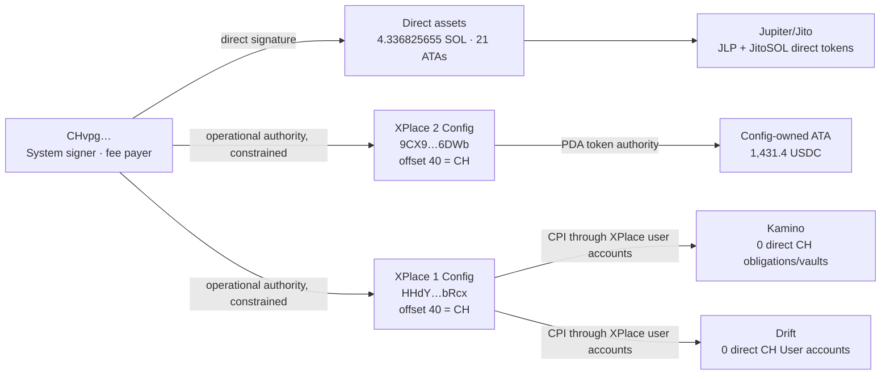

# `CHvpgjgJNDboeagrHRCA3hsyCddUjwf54LdvZ4tUzbHE` — глубокая карта средств, программ и полномочий

**Network:** Solana mainnet-beta
**Account snapshot:** slot `434738815`
**Token snapshot:** slot `434738817`
**Price evidence:** Jupiter Price API V3 block IDs `433438510`…`434740515`
**Scope:** текущие средства, program/PDA funds, protocol positions, полная видимая instruction surface двух XPlace-программ, signer layouts, upgrade/mint/delegate/stake/LUT authority.

## 0. Главный результат

`CHvpg…UzbHE` — **System account, required signer и fee payer**, а также **операционный authority, встроенный в обе XPlace Config PDA по byte offset 40**. Это существенно сильнее прежнего вывода «адрес просто встречается в транзакциях»:

- просканированы **все `13,324` текущих program-owned аккаунта** двух XPlace-программ;
- `CHvpgjgJNDboeagrHRCA3hsyCddUjwf54LdvZ4tUzbHE` найден ровно в **одном `Config` account каждой программы**, оба раза по offset `40`;
- в **ни одном** другом current XPlace program-owned account адрес не найден;
- в успешной выборке worker-методы `RepayByWorker`, `BorrowByWorkerKamino`, `BorrowByWorkerDrift` выполняются с единственным required signer — `CHvpgjgJNDboeagrHRCA3hsyCddUjwf54LdvZ4tUzbHE`;
- при этом `CHvpgjgJNDboeagrHRCA3hsyCddUjwf54LdvZ4tUzbHE` не является upgrade authority, mint/freeze authority, token delegate, stake authority или authority любой из 26 просмотренных Address Lookup Tables.

### Классы средств

| Класс | Средства | Индикативная стоимость | Что именно доступно |
|---|---:|---:|---|
| Direct System balance | `4.336825655 SOL` | $330.75 | непосредственно по подписи `CHvpg…UzbHE` |
| Direct SPL + Token-2022 | 21 ATA, 20 non-zero token balances | $9.892556 | `CHvpg…UzbHE` — token owner, delegates отсутствуют |
| Recoverable token-account rent | `0.0431868 SOL` | $3.293693 | после обнуления и закрытия ATA; не считать текущей ликвидностью |
| XPlace Program 2 Config vault | `1,431.4 USDC` | $1,431.29 | **program-controlled**, `CHvpg…UzbHE` operational authority; не direct-wallet balance |
| XPlace Program 1 Config vault | `0 USDC` | `$0` | program-controlled empty ATA |
| Direct Kamino positions | 0 obligations, 0 KVault positions, 0 rewards | `$0` | прямой позиции `CHvpg…UzbHE` нет |
| Direct Drift positions | 0 Drift User accounts | `$0` | прямой Drift position `CHvpg…UzbHE` нет |
| Direct Jupiter exposure | `0.097682 JLP` | $0.355238 | прямой transferable token balance |
| Direct Jito exposure | `0.005016 JitoSOL` | $0.492638 | прямой liquid-staking token balance |
| Orca/Raydium/Meteora LP | 0 position-NFT evidence | `$0` persistent direct position | в выборке есть swaps, но не direct LP position |

**Direct liquid mark excluding rent:** `$340.65`.
**Including potentially recoverable ATA rent:** `$343.94`.

> USD — это price mark, не executable quote. Для low-organic-score и unverified токенов ожидаемая цена реализации может быть существенно ниже. Jupiter отдельно предупреждает, что DeFi pricing зависит от ликвидности и эвристик, а ненадёжные цены могут отсутствовать: <https://developers.jup.ag/docs/price>.

## 1. Карта владения и доступа



### Почему `1,431.4 USDC` — не «баланс кошелька CH»

USDC token account `6osAkwJXbLe2it2iiuQLWcWpejpVGCg1W11UekHd9C2Q` имеет token owner `9CX9RyosaZusW7KZsNGSw4znN3kXZ9neFLgUHAQc6DWb`, а `9CX9RyosaZusW7KZsNGSw4znN3kXZ9neFLgUHAQc6DWb` принадлежит XPlace Program 2. Следовательно:

1. `CHvpg…UzbHE` не может подписать обычный SPL `Transfer` как token owner этого ATA;
2. XPlace Program 2 может подписать за PDA через seeds;
3. `CHvpg…UzbHE` встроен в Config и успешно выполняет worker-инструкции;
4. движение USDC возможно только через конкретную instruction surface и её on-chain constraints;
5. это **program-controlled operational balance**, а не свободно расходуемые direct funds.

## 2. XPlace Config: точное on-chain доказательство роли

Обе программы используют Anchor account discriminator:

```text
sha256("account:Config")[0..8] = 9b0caae01efacc82
```

| Program | Config account | Space | offset 8 | offset 40 | downstream references |
|---|---|---:|---|---|---|
| XPlace Program 2 `Ar2YW…7EZa7` | `9CX9RyosaZusW7KZsNGSw4znN3kXZ9neFLgUHAQc6DWb` | 381 | `6yANiqv13yE9TFzj4y3M1zceSdMw77xHegGCnXdJzrAn` | `CHvpgjgJNDboeagrHRCA3hsyCddUjwf54LdvZ4tUzbHE` | offset 72 → XPlace Program 1 |
| XPlace Program 1 `CWhvr…GaHop` | `HHdYSwJ4KNtw45nYTFwEyxJ5qamGTEdD2e4vKxuVbRcx` | 2721 | `6yANiqv13yE9TFzj4y3M1zceSdMw77xHegGCnXdJzrAn` | `CHvpgjgJNDboeagrHRCA3hsyCddUjwf54LdvZ4tUzbHE` | 72 → KLend; 104 → Drift; 136 → XPlace Program 2 |

`6yANiqv13yE9TFzj4y3M1zceSdMw77xHegGCnXdJzrAn` классифицирован как admin/controller **по структуре и instruction surface** (`UpdateConfig`, `ConfirmAdminRotation`, `WithdrawRevenue`); published IDL у программ отсутствует, поэтому имя поля offset 8 отмечено как inference. Классификация offset 40 как operational/worker authority подтверждается одновременно layout-совпадением и успешными one-signer worker-транзакциями.

### Program-owned account inventory

| Program | Accounts | Native lamports in all owned accounts | Main layouts | Интерпретация |
|---|---:|---:|---|---|
| XPlace Program 2 | `3,186` | `3.748996345 SOL` | 3,168×41 B; 16×30 B; Config 381 B | главным образом rent/account-state по всем users; не CH balance |
| XPlace Program 1 | `10,138` | `13.136958242 SOL` | 5,066×96 B + 5,066×13 B; Config 2,721 B | главным образом rent/account-state по всем users; не CH balance |

Суммы `3.748996345` и `13.136958242 SOL` не включены в net worth `CHvpg…UzbHE`: владельцами этих аккаунтов являются программы, а не System account CH.

## 3. Полная видимая instruction surface XPlace Program 2

ProgramData deployed slot `430526032`, SHA-256 `69e96442df0248956c564d3f2d0870596744da400f3c53d01c16573478de5259`. Найдено **15** application methods:

| Method | Access class | Evidence |
|---|---|---|
| `Init` | admin/config surface; CH-доступ не подтверждён | binary surface; в выборке не встречен |
| `UpdateConfig` | admin/config surface; CH-доступ не подтверждён | binary surface; в выборке не встречен |
| `ConfirmAdminRotation` | admin/config surface; CH-доступ не подтверждён | binary surface; в выборке не встречен |
| `Migrate` | admin/config surface; CH-доступ не подтверждён | binary surface; в выборке не встречен |
| `RepayByWorker` | worker/automation surface; CH-доступ подтверждён только там, где есть успешный one-signer evidence | выборка: 51 success / 0 failed; 1 signer=51, 2 signers=0 |
| `ReclaimByWorker` | worker/automation surface; CH-доступ подтверждён только там, где есть успешный one-signer evidence | binary surface; в выборке не встречен |
| `CreateAccount` | user/account lifecycle; может требовать user/recipient/position signer и account constraints | выборка: 6 success / 3 failed; 1 signer=9, 2 signers=0; агрегация двух XPlace programs |
| `UpdateRepayLimit` | user/account lifecycle; может требовать user/recipient/position signer и account constraints | выборка: 2 success / 0 failed; 1 signer=0, 2 signers=2 |
| `TopUp` | user/account lifecycle; может требовать user/recipient/position signer и account constraints | выборка: 19 success / 4 failed; 1 signer=23, 2 signers=0 |
| `Withdraw` | user/account lifecycle; может требовать user/recipient/position signer и account constraints | выборка: 11 success / 0 failed; 1 signer=0, 2 signers=11 |
| `WithdrawByWorker` | worker/automation surface; CH-доступ подтверждён только там, где есть успешный one-signer evidence | binary surface; в выборке не встречен |
| `TakeSubscriptionPayment` | worker/automation surface; CH-доступ подтверждён только там, где есть успешный one-signer evidence | binary surface; в выборке не встречен |
| `WithdrawRevenue` | admin/config surface; CH-доступ не подтверждён | binary surface; в выборке не встречен |
| `UpdateSubscriptionConfig` | admin/config surface; CH-доступ не подтверждён | binary surface; в выборке не встречен |
| `ReturnRefund` | worker/automation surface; CH-доступ подтверждён только там, где есть успешный one-signer evidence | binary surface; в выборке не встречен |

### Guardrails, присутствующие в текущем binary

`instruction enabled`, token allowlist, temporary pause, insufficient balance, per-transaction/daily repay limits, swap structure/source/destination validation, payment/subscription limits и maximum repay fee. Поэтому даже подтверждённый worker key не равен произвольному праву перевести любой program-owned asset на любой адрес.

## 4. Полная видимая instruction surface XPlace Program 1

ProgramData deployed slot `433046915`, SHA-256 `ff1c8445dc9c6ce287ccdaf5455654a87e0ce5dcde2984882bc119604aafaaa5`. Найдено **40** application methods:

| Method | Access class | Evidence |
|---|---|---|
| `Init` | admin/config surface; CH-доступ не подтверждён | binary surface; в выборке не встречен |
| `UpdateConfig` | admin/config surface; CH-доступ не подтверждён | binary surface; в выборке не встречен |
| `ExtendWhitelist` | admin/config surface; CH-доступ не подтверждён | binary surface; в выборке не встречен |
| `ConfirmAdminRotation` | admin/config surface; CH-доступ не подтверждён | binary surface; в выборке не встречен |
| `WithdrawRevenue` | admin/config surface; CH-доступ не подтверждён | binary surface; в выборке не встречен |
| `Migrate` | admin/config surface; CH-доступ не подтверждён | binary surface; в выборке не встречен |
| `BatchCreateLoanSnapshot` | worker/automation surface; CH-доступ подтверждён только там, где есть успешный one-signer evidence | binary surface; в выборке не встречен |
| `BorrowSyncByWorkerKamino` | worker/automation surface; CH-доступ подтверждён только там, где есть успешный one-signer evidence | binary surface; в выборке не встречен |
| `BorrowByWorkerKamino` | worker/automation surface; CH-доступ подтверждён только там, где есть успешный one-signer evidence | выборка: 9 success / 0 failed; 1 signer=9, 2 signers=0 |
| `RepaySyncByWorkerKamino` | worker/automation surface; CH-доступ подтверждён только там, где есть успешный one-signer evidence | binary surface; в выборке не встречен |
| `RepayByWorkerKamino` | worker/automation surface; CH-доступ подтверждён только там, где есть успешный one-signer evidence | binary surface; в выборке не встречен |
| `RepayByWorkerDrift` | worker/automation surface; CH-доступ подтверждён только там, где есть успешный one-signer evidence | binary surface; в выборке не встречен |
| `BorrowByWorkerDrift` | worker/automation surface; CH-доступ подтверждён только там, где есть успешный one-signer evidence | выборка: 6 success / 0 failed; 1 signer=6, 2 signers=0 |
| `CreateAccount` | user/account lifecycle; может требовать user/recipient/position signer и account constraints | выборка: 6 success / 3 failed; 1 signer=9, 2 signers=0; агрегация двух XPlace programs |
| `CreateAccountKamino` | user/account lifecycle; может требовать user/recipient/position signer и account constraints | binary surface; в выборке не встречен |
| `CreateAccountDrift` | user/account lifecycle; может требовать user/recipient/position signer и account constraints | binary surface; в выборке не встречен |
| `CloseAccountDrift` | user/account lifecycle; может требовать user/recipient/position signer и account constraints | binary surface; в выборке не встречен |
| `RebalanceDrift` | worker/automation surface; CH-доступ подтверждён только там, где есть успешный one-signer evidence | binary surface; в выборке не встречен |
| `UpdateBorrowLimit` | user/account lifecycle; может требовать user/recipient/position signer и account constraints | binary surface; в выборке не встречен |
| `DepositDrift` | user/account lifecycle; может требовать user/recipient/position signer и account constraints | binary surface; в выборке не встречен |
| `DepositKamino` | user/account lifecycle; может требовать user/recipient/position signer и account constraints | выборка: 6 success / 0 failed; 1 signer=3, 2 signers=3 |
| `WithdrawDrift` | user/account lifecycle; может требовать user/recipient/position signer и account constraints | binary surface; в выборке не встречен |
| `WithdrawKamino` | user/account lifecycle; может требовать user/recipient/position signer и account constraints | binary surface; в выборке не встречен |
| `WithdrawAndSendKamino` | user/account lifecycle; может требовать user/recipient/position signer и account constraints | выборка: 1 success / 0 failed; 1 signer=0, 2 signers=1 |
| `BorrowSyncKamino` | user/account lifecycle; может требовать user/recipient/position signer и account constraints | binary surface; в выборке не встречен |
| `BorrowKamino` | user/account lifecycle; может требовать user/recipient/position signer и account constraints | выборка: 2 success / 0 failed; 1 signer=0, 2 signers=2 |
| `BorrowDrift` | user/account lifecycle; может требовать user/recipient/position signer и account constraints | binary surface; в выборке не встречен |
| `RepaySyncKamino` | user/account lifecycle; может требовать user/recipient/position signer и account constraints | binary surface; в выборке не встречен |
| `RepayKamino` | user/account lifecycle; может требовать user/recipient/position signer и account constraints | binary surface; в выборке не встречен |
| `RepayDrift` | user/account lifecycle; может требовать user/recipient/position signer и account constraints | binary surface; в выборке не встречен |
| `RepayWithBuffer` | user/account lifecycle; может требовать user/recipient/position signer и account constraints | binary surface; в выборке не встречен |
| `RepayWithBufferKamino` | user/account lifecycle; может требовать user/recipient/position signer и account constraints | binary surface; в выборке не встречен |
| `WithdrawByWorker` | worker/automation surface; CH-доступ подтверждён только там, где есть успешный one-signer evidence | binary surface; в выборке не встречен |
| `WithdrawByWorkerKamino` | worker/automation surface; CH-доступ подтверждён только там, где есть успешный one-signer evidence | binary surface; в выборке не встречен |
| `CompleteDeleverageKamino` | worker/automation surface; CH-доступ подтверждён только там, где есть успешный one-signer evidence | binary surface; в выборке не встречен |
| `ClaimDfxDrift` | worker/automation surface; CH-доступ подтверждён только там, где есть успешный one-signer evidence | binary surface; в выборке не встречен |
| `UpdateTargetBorrowApyKamino` | worker/automation surface; CH-доступ подтверждён только там, где есть успешный one-signer evidence | binary surface; в выборке не встречен |
| `UpdateLoanSnapshotKamino` | worker/automation surface; CH-доступ подтверждён только там, где есть успешный one-signer evidence | binary surface; в выборке не встречен |
| `ResetLoanSnapshotKamino` | worker/automation surface; CH-доступ подтверждён только там, где есть успешный one-signer evidence | binary surface; в выборке не встречен |
| `RevertRepayWithBufferKamino` | worker/automation surface; CH-доступ подтверждён только там, где есть успешный one-signer evidence | binary surface; в выборке не встречен |

### Guardrails, присутствующие в текущем binary

Whitelist/asset-type validation, daily borrow limit, flash-loan open/close structure, swap-account and balance checks, tax-wallet checks, transfer-hook/confidential-transfer extension checks, target APY/loan-snapshot freshness, bundle structure, deleverage residue и repay-buffer revert timeout.

## 5. Что CH фактически выполняет один, а где нужен второй signer

| Primary method / flow | Successful | Failed | CH-only messages | Two-signer messages | Вывод |
|---|---:|---:|---:|---:|---|
| `BorrowByWorkerKamino` | 9 | 0 | 9 | 0 | CH-alone execution evidence |
| `TopUp` | 19 | 4 | 23 | 0 | CH-alone execution evidence |
| `RepayByWorker` | 51 | 0 | 51 | 0 | CH-alone execution evidence |
| `UpdateRepayLimit` | 2 | 0 | 0 | 2 | second signer required in sampled messages |
| `RouteV2` | 2 | 0 | 0 | 2 | second signer required in sampled messages |
| `Withdraw` | 11 | 0 | 0 | 11 | second signer required in sampled messages |
| `SharedAccountsRouteV2` | 5 | 0 | 0 | 5 | second signer required in sampled messages |
| `CreateAccount` | 6 | 3 | 9 | 0 | CH-alone execution evidence |
| `DepositKamino` | 6 | 0 | 3 | 3 | mixed/flow-dependent |
| `unknown` | 6 | 0 | 0 | 6 | second signer required in sampled messages |
| `BorrowKamino` | 2 | 0 | 0 | 2 | second signer required in sampled messages |
| `WithdrawAndSendKamino` | 1 | 0 | 0 | 1 | second signer required in sampled messages |
| `GetAccountDataSize` | 14 | 0 | 0 | 14 | second signer required in sampled messages |
| `CreateTokenAccount` | 1 | 0 | 0 | 1 | second signer required in sampled messages |
| `BorrowByWorkerDrift` | 6 | 0 | 6 | 0 | CH-alone execution evidence |


Особенно важное разделение:

- **CH-only success:** `RepayByWorker` (51), `BorrowByWorkerKamino` (9), `BorrowByWorkerDrift` (6), часть `TopUp` и `CreateAccount`.
- **Two-signer:** `UpdateRepayLimit`, `Withdraw`, sampled Jupiter routes, `BorrowKamino`, `WithdrawAndSendKamino`.
- `DepositKamino` встречается в обоих layouts; конкретный account graph определяет, нужен ли user/recipient signer.

## 6. Все текущие direct token balances

Все 21 token account:

- являются Associated Token Accounts для `CHvpgjgJNDboeagrHRCA3hsyCddUjwf54LdvZ4tUzbHE`;
- `owner = CHvpgjgJNDboeagrHRCA3hsyCddUjwf54LdvZ4tUzbHE`;
- `delegate = none`;
- mint authority matches = `0/21`;
- freeze authority matches = `0/21`.

| Symbol | Mint | Token account | Amount | USD price | USD mark | Jupiter quality | Token-2022 extensions |
|---|---|---|---:|---:|---:|---|---|
| SOL | `So11111111111111111111111111111111111111112` | `B8g6A7BpQaVh9smcq6a2gmLaqpGXm5t6V4PKcMFydCSr` | 0 | 76.2661894 | $0.000000 | verified/high | — |
| cbBTC | `cbbtcf3aa214zXHbiAZQwf4122FBYbraNdFqgw4iMij` | `9UVoUCFaQy9LDns8NZQ6NqdJjpbveUNbHdJ7SjqgkBPz` | 0.000005 | 64895.98488 | $0.324480 | verified/high | — |
| RENDER | `rndrizKT3MK1iimdxRdWabcF7Zg7AR5T4nud4EkHBof` | `GTdXF8F46CeXsRV8MVrdiaWeARELirqiuJAqYtidbv72` | 0.108828 | 1.494165035 | $0.162607 | verified/medium | — |
| JLP | `27G8MtK7VtTcCHkpASjSDdkWWYfoqT6ggEuKidVJidD4` | `CEmVQeN7wYYCouSs4Npodix5AwEBjKRXa6VNrSg9q8kH` | 0.097682 | 3.636673149 | $0.355238 | verified/high | — |
| WBTC | `3NZ9JMVBmGAqocybic2c7LQCJScmgsAZ6vQqTDzcqmJh` | `GThU3m3PobboRcHxkNsv7rpGkZh4GXWUqie1cGoSaz2r` | 0.000004 | 64667.88318 | $0.258672 | verified/high | — |
| ETH | `7vfCXTUXx5WJV5JADk17DUJ4ksgau7utNKj4b963voxs` | `68BrNgjpnM5LKTvKS3v27CrT1HKqt9wEKT2Gm2iniKJC` | 0.000339 | 1894.892372 | $0.642369 | verified/high | — |
| NVDA | `9dwPiStDBwJJqC3QzMnjpJP7xohZbMVmHELFx3uy3KRq` | `EFvQHkse5RynMEwcrPExovyv1t9M94wFtMAfcn6PguR6` | 2442.045041 | 7.912466997e-05 | $0.193226 | verified/low | — |
| syrupUSDC | `AvZZF1YaZDziPY2RCK4oJrRVrbN3mTD9NL24hPeaZeUj` | `AtkknLr4HNND4PuW7LRy2HpkQHYvfPA6fYMFLLXs1tr` | 0.146014 | 1.174633745 | $0.171513 | verified/medium | — |
| USDTet | `Dn4noZ5jgGfkntzcQSUZ8czkreiZ1ForXYoV2H8Dm7S1` | `3ZwaGbKx5ShprkfNmWQEhLXb5iEoF6FH8Mfty44GhocN` | 0.18054 | 0.9986224094 | $0.180291 | verified/low | — |
| USDC | `EPjFWdd5AufqSSqeM2qN1xzybapC8G4wEGGkZwyTDt1v` | `7We9GuSEL5dND9YAtieRffXUCkovTz9uv3Hjk2w94MB4` | 2.360206 | 0.9999198025 | $2.360017 | verified/high | — |
| USDT | `Es9vMFrzaCERmJfrF4H2FYD4KCoNkY11McCe8BenwNYB` | `81WN9ssMkMiT4foJm89m92PPwhf2FofRbiogYkQEyRhY` | 3.675214 | 0.9993300675 | $3.672752 | verified/high | — |
| MELANIA | `FUAfBo2jgks6gB4Z4LfZkqSZgzNucisEHqnNebaRxM1P` | `B2DD1uAWgCmz1KnuzkLUnHQ3QdDhFYLcANtik8qTbkUJ` | 1.664863 | 0.08029290414 | $0.133677 | verified/low | — |
| BIG | `Foot4fxy8CHxM37W8BeHwK6aLd8VH2yHTFu43KCxbCqc` | `7KUj2r34x2Ax6XxmppCtPYrJ52nSC1uemh81vQT7Rae9` | 2111.52805 | 0.0001056858825 | $0.223159 | unverified/low | — |
| TRX | `GbbesPbaYh5uiAZSYNXTc7w9jty1rpg3P9L4JeN4LkKc` | `4RjxG8NkxLWgGAbvmXT1UAkGJVZoo4kFQmz7DuSV5F7a` | 0.567393 | 0.326958232 | $0.185514 | verified/low | — |
| JitoSOL | `J1toso1uCk3RLmjorhTtrVwY9HJ7X8V9yYac6Y7kGCPn` | `jigLVAJ46erehXUtaWPFNsQX4CqpRK4DgSUqussm6xR` | 0.005016 | 98.21334026 | $0.492638 | verified/high | — |
| Punch | `NV2RYH954cTJ3ckFUpvfqaQXU4ARqqDH3562nFSpump` | `785vZtazqHFsuf98pSVZPvgenXJt5B3Th2d7jmL2Kqms` | 16.957433 | 0.001229471481 | $0.020849 | verified/medium | immutableOwner |
| 雪山救狐 | `ijq5Vaxog5xZvqbt9NfGpm7mndrwBGQaydXNNsmpump` | `nivr8DNindJLK6PrwVUC9sFb3cwRMPUZxorCx1JJB5w` | 138.380711 | 3.21472163e-06 | $0.000445 | unverified/low | immutableOwner |
| PUMP | `pumpCmXqMfrsAkQ5r49WcJnRayYRqmXz6ae8H7H9Dfn` | `8ftVeNsLGnNdibuEVvyoinaesYfMXdbQ2Wn7gs5as8SR` | 100.149013 | 0.001935787326 | $0.193867 | verified/high | immutableOwner,transferHookAccount |
| PYUSD | `2b1kV6DkPAnxd5ixfnxCpjxmKwqjjaYmCZfHsFu24GXo` | `BUpf8UURGEt4xGHbz2GEujwkBh8tV6RM4gteujqsksNq` | 0.173242 | 0.9999223725 | $0.173229 | verified/high | immutableOwner,transferFeeAmount,transferHookAccount |
| ANSEM | `9cRCn9rGT8V2imeM2BaKs13yhMEais3ruM3rPvTGpump` | `5iVhcU6WnqwLGe8RpCpfogVMSpiRNEAobXGPWKHJdrud` | 0.867303 | 0.166641633 | $0.144529 | verified/high | immutableOwner |
| DURCOIN | `BKMp8wXfbsRjAQ65rpDgUPjL8s1xFDAtVWzw3eeQpump` | `22Fg3rZHy66352BgwbTzRrzULKAPZCLCAyZWJn1gi2Mv` | 777 | 4.487959127e-06 | $0.003487 | unverified/low | immutableOwner |

Token-2022 detail: PUMP и PYUSD ATAs содержат `transferHookAccount`; PYUSD также имеет `transferFeeAmount` с `withheldAmount=0`. Это не delegate CH, но transfer может потребовать extra account metas и исполнения hook-программы.

## 7. Средства/позиции по внешним программам

### Kamino

Проверено тремя read-only endpoint families для `CHvpgjgJNDboeagrHRCA3hsyCddUjwf54LdvZ4tUzbHE`:

```json
obligations = []
kvault positions = []
rewards = {"avgBaseApy":"0","avgBoostedApy":"0","avgMaxApy":"0","rewards":[]}
```

Kamino определяет obligations как loans конкретного user wallet и предоставляет именно endpoint `.../users/{userPubkey}/obligations`: <https://kamino.com/docs/build/api-reference/borrow/user-and-loans-data/user-obligations>. KVault positions возвращают staked/unstaked shares пользователя: <https://kamino.com/docs/build/api-reference/earn/user-data/user-vault-position>.

**Вывод:** на `CHvpg…UzbHE` нет direct Kamino collateral/borrow/vault/reward balance. Исторические Kamino CPI идут через XPlace-owned user/obligation accounts, где `CHvpg…UzbHE` действует как worker/fee payer.

### Drift

Official SDK method `getUserAccountsAndAddressesForAuthority(authority)` вернул `[]`; Drift документирует этот authority query в SDK: <https://docs.drift.trade/developers/drift-sdk/autogen>.

**Вывод:** на `CHvpg…UzbHE` нет direct Drift spot/perp/user account. `BorrowByWorkerDrift`/`RepayByWorkerDrift` обслуживают XPlace proxy accounts.

### Jupiter, Orca, Raydium, Meteora

- direct Jupiter exposure: `0.097682 JLP` ≈ $0.355238;
- observed routing: Jupiter V6 → Orca/Raydium CLMM/Meteora/ript;
- direct position-NFT evidence: `0`; у всех 21 direct mints decimals ≥ 6, нет classic concentrated-liquidity NFT balance;
- значит в текущем direct inventory есть swaps и JLP, но нет direct Orca/Raydium/Meteora LP position.

### Jito, bridge assets и прочие tokenized exposures

- `0.005016 JitoSOL` ≈ $0.492638;
- `0.000005 cbBTC`, `0.000004 WBTC`, `0.000339 ETH`, `0.18054 USDTet`;
- `0.146014 syrupUSDC`;
- эти суммы — direct transferable token balances, а не evidence отдельного CH-owned lending/LP account.

## 8. Дополнительные полномочия, которых нет

| Authority surface | Проверено | Match CH |
|---|---:|---:|
| Upgrade authority observed programs | 11 programs | 0 |
| Mint authority direct mints | 21 mints | 0 |
| Freeze authority direct mints | 21 mints | 0 |
| Current token delegates | 21 ATAs | 0 |
| Native stake staker offset | Stake Program scan | 0 |
| Native stake withdrawer offset | Stake Program scan | 0 |
| Address Lookup Table authority | 26 used LUTs | 0 |
| Drift direct User authority | Drift SDK query | 0 |
| Kamino direct obligation/vault/reward owner | Kamino APIs | 0 |

## 9. Денежные потоки в 148-transaction sample

Sample contains 141 successful and 7 failed finalized transactions. `CHvpg…UzbHE` paid `0.004263806 SOL` fees. Net native delta in this stratified sample is `+0.379687518 SOL`; это sample-only result, в котором есть non-protocol direct transfers и поэтому его нельзя экстраполировать на весь период.

Selected exact token-owner deltas:

| Token owner class | Mint | Net | Gross in | Gross out | Associated flow |
|---|---|---:|---:|---:|---|
| CH_DIRECT | `EPjFWdd5AufqSSqeM2qN1xzybapC8G4wEGGkZwyTDt1v` | 0.190683 | 0.190683 | 0 | Withdraw |
| XPLACE1_CONFIG | `EPjFWdd5AufqSSqeM2qN1xzybapC8G4wEGGkZwyTDt1v` | 1.34475 | 1.34475 | 0 | BorrowByWorkerDrift |
| XPLACE2_CONFIG | `EPjFWdd5AufqSSqeM2qN1xzybapC8G4wEGGkZwyTDt1v` | 1.32 | 1.32 | 0 | RepayByWorker |


Эти sample flows подтверждают накопление worker-related USDC в XPlace Config ATAs, но не являются all-time volume.

## 10. Историческое покрытие

RPC crawler перечислил `148,000` finalized signatures от `2026-03-14T16:28:40Z` до `2026-07-23T15:05:15Z`:

- success: `143,227`;
- failed: `4,773`;
- all-time completeness: `false`;
- next cursor: `3aBZdBJBQnGTvQZi8GtRXAXfrHYXwRF54LGHG5LyvXmvwpHzZ93DmqzhfiFk97f8TsEyxS2ZvessTTqpWtXswyaX`.

Solana `getSignaturesForAddress` возвращает signatures, которые ссылаются на address в account keys, newest-first, и поддерживает pagination cursor `before`: <https://solana.com/docs/rpc/http/getsignaturesforaddress>. Поэтому сохранённый cursor позволяет продолжить исторический crawl без повторного начала.

## 11. Методика и границы доказательств

1. Direct token ownership — `getTokenAccountsByOwner`, официальный RPC semantics: <https://solana.com/docs/rpc/http/gettokenaccountsbyowner>.
2. XPlace account inventory/config search — `getProgramAccounts` with data-size and memcmp/byte scans; RPC возвращает accounts owned by program и поддерживает filters: <https://solana.com/docs/rpc/http/getprogramaccounts>.
3. Transaction methods/signers/flows — finalized `getTransaction`, message headers, static/loaded keys, pre/post balances, token balances и logs.
4. XPlace full method surface/guardrails — strings and source-path symbols from current on-chain ProgramData binaries, with SHA-256 recorded above.
5. Token metadata/quality — Jupiter Tokens V2. It returns name/symbol/holder/organic-score/verified fields: <https://developers.jup.ag/docs/tokens/token-information>.
6. USD marks — Jupiter Price API V3; `usdPrice` + `blockId`, максимум 50 IDs per request: <https://developers.jup.ag/docs/price>.

### Что здесь намеренно не приписано CH

- весь XPlace program TVL;
- balances user-specific XPlace/Kamino/Drift accounts;
- rent lamports всех program-owned accounts;
- admin/update authority `6yANiqv13yE9TFzj4y3M1zceSdMw77xHegGCnXdJzrAn`;
- program upgrade authority `61XyY6sTZfCSzKom9HjZcHbXrvSnWkqhS4aAGvs2ro5u`;
- arbitrary withdrawal из Config vault без прохождения on-chain constraints.

## 12. Артефакты

- Machine-readable full map: `artifacts/solana/ch-account-interaction-map.json`
- Consolidated fund ledger: `artifacts/solana/ch-account-funds.csv`
- Historical signature cursor remains embedded in the JSON artifact.
