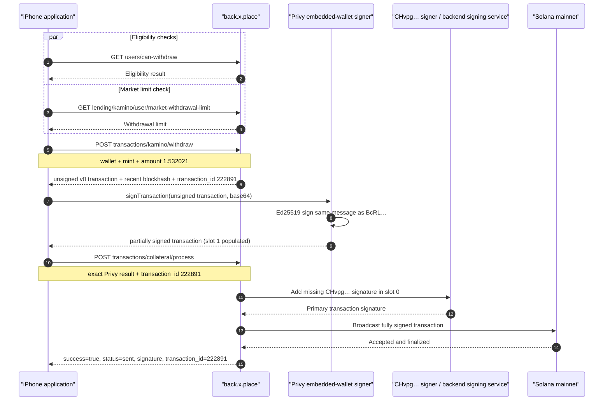

# Kamino withdrawal: transaction construction, two-party signing, and broadcast

**Status:** verified from synchronized proxbot HTTP evidence, byte-level Solana
transaction parsing, Ed25519 signature verification, and Solana mainnet RPC.

**Observed at:** 2026-07-23 13:29:32–13:29:33 UTC  
**proxbot session:** `b14e552e-736b-49e3-a9cc-e70f6102c5a3`  
**Internal transaction ID:** `222891`  
**Solana transaction signature:**
`4siQLsSYnHkzKh5QC8vWKChEpgRKL8mPAN1q1QovSF38bwcgVSBgCJ54inbTkx1DbpVY8kx5x44CiJEPfC9m3GvM`

## Подтверждённый вывод

Полная последовательность установлена однозначно:

1. Приложение параллельно проверяет возможность вывода и доступный лимит
   через `back.x.place`.
2. `POST /api/v1/transactions/kamino/withdraw/` формирует Solana v0
   transaction с двумя обязательными, но пока пустыми слотами подписи. Backend
   также возвращает `recent_blockhash` и внутренний `transaction_id = 222891`.
3. Приложение передаёт эту transaction в
   `auth.privy.io/api/v1/wallets/[wallet_id]/rpc` с методом
   `signTransaction`.
4. Privy не меняет message, инструкции, accounts, lookup tables или
   blockhash. Он заполняет только слот подписи 1.
5. Подпись из слота 1 криптографически проверена по Ed25519 и принадлежит
   `BcRLWYBos6tgYGujeJNPqwFHwhrhx7xbZHzkMQuEJJpi`.
6. Приложение передаёт точный результат Privy в
   `POST /api/v1/transactions/collateral/process/`. В этот момент слот подписи
   0 ещё пуст.
7. Backend либо связанный с ним signing service добавляет подпись
   `CHvpgjgJNDboeagrHRCA3hsyCddUjwf54LdvZ4tUzbHE` в слот 0 и отправляет
   полностью подписанную transaction в Solana.
8. Возвращённая endpoint-подпись проверяется по Ed25519 для `CHvpg…`,
   совпадает с первой подписью финальной on-chain transaction и является её
   Solana transaction identifier.
9. Solana mainnet подтвердил transaction как `finalized` в slot `434723923`
   без execution error.

Следовательно, обращение к Privy — это **подпись кошелька BcRL**, но не
broadcast. Фактическая граница co-signing и broadcast находится после
`transactions/collateral/process/`. Приватный ключ BcRL в перехваченном
трафике не передаётся: приложение отправляет сериализованный message, а Privy
возвращает готовую Ed25519-подпись внутри transaction.

## Conclusion

The iPhone application does not construct the complete transaction, sign every
required signature, or broadcast directly to a public Solana RPC endpoint.
The observed workflow is:

1. `back.x.place` validates the withdrawal and constructs an unsigned Solana v0
   transaction requiring two signatures.
2. The application sends that exact transaction message to the embedded-wallet
   RPC at `auth.privy.io` using `signTransaction`.
3. Privy adds the signature for
   `BcRLWYBos6tgYGujeJNPqwFHwhrhx7xbZHzkMQuEJJpi` in signature slot 1 and
   returns a partially signed transaction. The transaction message is not
   modified.
4. The application sends that exact partially signed transaction to
   `back.x.place/api/v1/transactions/collateral/process/`.
5. The backend, or a downstream signer controlled by that endpoint, adds the
   missing signature for
   `CHvpgjgJNDboeagrHRCA3hsyCddUjwf54LdvZ4tUzbHE` in signature slot 0 and
   broadcasts the completed transaction.
6. The process endpoint returns `status: "sent"` and the first Solana
   signature, which is also the transaction identifier.
7. Solana mainnet RPC reports the transaction as `finalized` with no execution
   error.

The call to `auth.privy.io/.../rpc` is therefore a **signing operation**, not
the broadcast. The broadcast boundary is the subsequent
`transactions/collateral/process/` operation.

## End-to-end sequence



## Chronological evidence

| Phase | UTC start | Duration | proxbot sequence | Request ID | Endpoint | Result |
|---|---:|---:|---:|---|---|---|
| Eligibility | 13:29:32.086 | — | request `377`, response `381` | `e12f69ee-8b03-4158-94a4-9e1a841097c4` | `GET /api/v1/users/can-withdraw/` | Withdrawal eligibility checked |
| Market limit | 13:29:32.087 | — | request `378`, response `380` | `75168f88-9c35-4700-9596-415afa3a67d3` | `GET /api/v1/lending/kamino/user/market-withdrawal-limit/` | Available withdrawal limit checked |
| Build transaction | 13:29:32.426 | 427 ms | request `382`, response `383` | `737e358c-2b94-4c51-97d5-16049d00d95e` | `POST /api/v1/transactions/kamino/withdraw/` | Unsigned transaction and blockhash returned |
| Wallet signature | 13:29:33.107 | 145 ms | request `387`, response `388` | `81bab11c-4e04-4f98-8202-4d8d4a3188ad` | `POST /api/v1/wallets/[wallet_id]/rpc` | Privy signature added |
| Co-sign and broadcast | 13:29:33.277 | 175 ms | request `389`, response `390` | `77310f79-369d-46bb-9632-4d67b194cb1f` | `POST /api/v1/transactions/collateral/process/` | Backend returned `sent` and transaction signature |
| State refresh | 13:29:33.589 | — | request `392`, response `393` | `49a72747-f049-4835-9908-7bead9a19577` | `GET /api/v1/users/card-balances/` | Application refreshed balances |

All three core HTTP exchanges were recovered by `proxy-mitm`, identified by
`tls.sni`, and materialized with `plaintext_state = decrypted`. GZIP and
Brotli response bodies were decoded for the analyst view while their original
content-encoded bytes remained in the evidence artifacts.

## Stage 1: backend constructs the transaction

Request semantics:

```json
{
  "user_pubkey": "BcRLWYBos6tgYGujeJNPqwFHwhrhx7xbZHzkMQuEJJpi",
  "mint": "Es9vMFrzaCERmJfrF4H2FYD4KCoNkY11McCe8BenwNYB",
  "amount": "1.532021",
  "withdraw_max": false
}
```

The backend returned:

- `success = true`;
- `transaction_id = 222891`;
- `recent_blockhash =
  7qhbxBBgGNHeEYLaYkJ2dyrNQx5Trow3KsjMkk65Gfc4`;
- `message = null`;
- `insufficient_sol_for_fee = null`;
- a base64 Solana v0 transaction with two empty 64-byte signature slots.

Evidence:

- request body artifact:
  `proxy/request-bodies.bin @ 91284 + 157`;
- request artifact SHA-256:
  `75957744e0234da5eabe49178700da8f344eac40c9854ada0e901886d1957d7f`;
- compressed response artifact:
  `proxy/response-bodies.bin @ 15469 + 978`;
- response artifact SHA-256:
  `08000e0cc7062e57ce4a573ead0393d6a0dcf65438c254272f722d033d8f208a`.

## Stage 2: Privy signs the wallet slot

The application called the wallet RPC with:

```json
{
  "method": "signTransaction",
  "params": {
    "transaction": "<EXACT_BACKEND_TRANSACTION_BASE64>",
    "encoding": "base64"
  }
}
```

The response contained:

```json
{
  "method": "signTransaction",
  "data": {
    "signed_transaction": "<PARTIALLY_SIGNED_TRANSACTION_BASE64>",
    "encoding": "base64"
  }
}
```

Verified invariants:

- backend transaction bytes equal Privy request transaction bytes;
- Privy did not modify the serialized Solana message;
- recent blockhash did not change;
- account list, instructions, lookup tables, and compute-budget settings did
  not change;
- signature slot 0 remained empty;
- signature slot 1 changed from all zero bytes to
  `22nnRMMFX12CosNuFDjGCnvVKLK1JSAS9PQgRSVCEgumtEHLFMgjC4L6rLgunGWsXDtHUu5ru6tmu4EGs9USx2bd`;
- Ed25519 verification of slot 1 succeeds for public key
  `BcRLWYBos6tgYGujeJNPqwFHwhrhx7xbZHzkMQuEJJpi`.

Evidence:

- request body artifact:
  `proxy/request-bodies.bin @ 91441 + 1338`;
- request artifact SHA-256:
  `a9b7f1a269ce7e7e0d649f3c6d3d5646f7aba1cf8eb4f6d417f1813a0cbcdafc`;
- Brotli response artifact:
  `proxy/response-bodies.bin @ 16447 + 963`;
- response artifact SHA-256:
  `a15616a2a20bbedffe2aa09e2a8b13b619ac0bf6b043fb0f2cb3d7ef7bae6ed0`.

The HTTP `Authorization`, cookies, and
`privy-authorization-signature` authenticate the API request. They are not the
Solana Ed25519 transaction signature. Those credential values are deliberately
excluded from this report.

## Stage 3: backend co-signs and broadcasts

The application sent:

```json
{
  "tx_base64": "<EXACT_PRIVY_SIGNED_TRANSACTION_BASE64>",
  "transaction_id": 222891
}
```

Verified invariants:

- `tx_base64` equals the Privy `signed_transaction` byte-for-byte;
- `transaction_id` is `222891` in the build response, process request, and
  process response;
- the transaction submitted to the process endpoint still has an empty
  signature slot 0;
- the process response signature is not present in that partial transaction;
- the returned signature verifies against the unchanged transaction message
  and public key
  `CHvpgjgJNDboeagrHRCA3hsyCddUjwf54LdvZ4tUzbHE`;
- the returned signature becomes slot 0 in the finalized on-chain transaction.

Process response:

```json
{
  "success": true,
  "status": "sent",
  "signature": "4siQLsSYnHkzKh5QC8vWKChEpgRKL8mPAN1q1QovSF38bwcgVSBgCJ54inbTkx1DbpVY8kx5x44CiJEPfC9m3GvM",
  "transaction_id": 222891
}
```

Evidence:

- request body artifact:
  `proxy/request-bodies.bin @ 92779 + 1284`;
- request artifact SHA-256:
  `d509efa7153d623f468570634a1a8c7f310451a19339182c4c7c8951f2864343`;
- compressed response artifact:
  `proxy/response-bodies.bin @ 17410 + 166`;
- response artifact SHA-256:
  `279b422eb47773e4aa7198756333eba3335081b6c0f799bb7db6f1bfa2170bae`.

## Serialized Solana transaction

The transaction parser consumed the entire serialized message without trailing
or missing bytes.

| Property | Value |
|---|---|
| Message version | `v0` |
| Required signatures | `2` |
| Read-only signed accounts | `1` |
| Read-only unsigned accounts | `8` |
| Static accounts | `15` |
| Address lookup tables | `2` |
| Loaded lookup accounts | `20` |
| Total addressable accounts | `35` |
| Compiled instructions | `9` |
| Recent blockhash | `7qhbxBBgGNHeEYLaYkJ2dyrNQx5Trow3KsjMkk65Gfc4` |
| Message SHA-256 | `5677b7ea62f4b47c2ec4c682cff62403a1d4c1460d137350e92cf56d85880256` |
| Unsigned transaction SHA-256 | `60806423c1a275514216d78c0364fbd59befce324ea90146ac68fcb269be2910` |
| Privy-partially-signed transaction SHA-256 | `920f9af4956f6c54669ef896bf0acc735e5f30f5f95d76af1f06e70ae72f8654` |

Signer ordering is defined by the first two static account keys:

| Slot | Public key | Role from message | State after build | State after Privy | Final state |
|---:|---|---|---|---|---|
| 0 | `CHvpgjgJNDboeagrHRCA3hsyCddUjwf54LdvZ4tUzbHE` | writable signer and fee payer | empty | empty | valid backend-side signature |
| 1 | `BcRLWYBos6tgYGujeJNPqwFHwhrhx7xbZHzkMQuEJJpi` | read-only signer | empty | valid Privy signature | unchanged valid signature |

Compute-budget instructions request:

- compute-unit limit: `366782`;
- compute-unit price: `27395` micro-lamports.

The message also contains program calls to:

- `HFn8GnPADiny6XqUoWE8uRPPxb29ikn4yTuPa9MF2fWJ`;
- `KLend2g3cP87fffoy8q1mQqGKjrxjC8boSyAYavgmjD`;
- `CWhvrgNvYNdkT4gnjPcdVxaNB8HQkXgBTsJAwp3GaHop`;
- `ComputeBudget111111111111111111111111111111`.

Program labels beyond their observed IDs are not inferred in this report.

## On-chain verification

Read-only queries were executed against
`https://api.mainnet-beta.solana.com` using `getSignatureStatuses` and
`getTransaction` with `maxSupportedTransactionVersion = 0`.

Verified chain result:

| Property | Value |
|---|---|
| Confirmation status | `finalized` |
| Execution error | `null` |
| Slot | `434723923` |
| Block time | `1784813373` (`2026-07-23 13:29:33 UTC`) |
| Transaction version | `0` |
| Fee | `20048` lamports |
| Compute units consumed | `305950` |
| Primary signature | `4siQLsS…m3GvM` |
| Wallet signature | `22nnRMM…USx2bd` |

The finalized transaction contains both signatures in the expected order:

1. the signature verifying under `CHvpg…`;
2. the signature returned by Privy and verifying under `BcRL…`.

Observed token balance changes for mint
`Es9vMFrzaCERmJfrF4H2FYD4KCoNkY11McCe8BenwNYB`:

| Owner/account role | Pre | Post | Delta |
|---|---:|---:|---:|
| `BcRL…` wallet owner | `0` | `1.532023` | `+1.532023` |
| protocol-owned source | `1281264.767686` | `1281263.235665` | `-1.532021` |
| secondary token account | `0.000002` | `0` | `-0.000002` |

The requested withdrawal amount is exactly reflected in the protocol source
delta. The additional `0.000002` received by the wallet is separately visible
as the complete depletion of a secondary token account; this report records
the state transition without assigning an unobserved business meaning to that
cleanup.

The first signer balance decreased by exactly `20048` lamports, matching the
reported transaction fee. The wallet signer SOL balance did not change.

## Trust boundaries and exact responsibilities

| Component | Proven responsibility | Not observed in this component |
|---|---|---|
| iPhone app | collects parameters, relays serialized transactions, requests signing, submits partial transaction | no wallet private key material; no direct public Solana RPC broadcast in this flow |
| `back.x.place` build endpoint | validates parameters and constructs the unsigned v0 message | does not return either required signature |
| Privy wallet RPC | adds the valid `BcRL…` Ed25519 signature | does not add the `CHvpg…` signature; does not return a broadcast receipt |
| `back.x.place` process path / downstream signer | completes `CHvpg…` signature and returns the primary transaction signature | internal HSM/key custody implementation is not visible in HTTP evidence |
| Solana mainnet | executes and finalizes the completed two-signature transaction | application/backend internal `transaction_id = 222891` is off-chain metadata |

## Security handling

The source capture contains bearer tokens, Cloudflare cookies, Privy request
authentication, and complete serialized transactions. This report intentionally
retains only:

- public wallet, mint, program, lookup-table, blockhash, and transaction
  signatures;
- proxbot session/request identifiers;
- artifact offsets, sizes, and hashes;
- transaction structure and verified state transitions.

Bearer tokens, cookies, session identifiers, and Privy authorization material
are omitted. They must remain redacted in exports, screenshots, issue reports,
and MCP responses.
